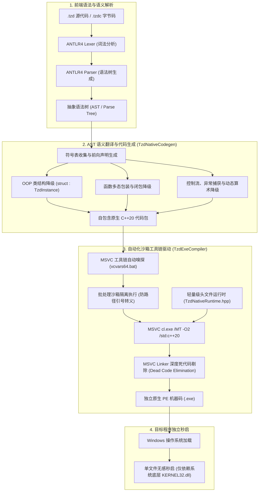

# TzdLang AOT 独立原生机器码编译器架构与参考手册

<p align="right">
  <a href="AOT-Compiler.md"><strong>English</strong></a> | <a href="AOT-Compiler-zh.md"><strong>中文</strong></a>
</p>

从 **v0.2.4** 起，TzdLang 引入了全自主研发的 **Ahead-Of-Time (AOT) 独立原生机器码编译器**。该编译器打破了传统动态脚本语言依赖庞大解释器环境（或 Fat-Stub 存根外挂）的壁垒，支持将 Tzd 源代码（`.tzd`）与预编译字节码（`.tzdc`）直接编译为**纯静态、零第三方 DLL 依赖、体积仅约 300KB 的 Windows 原生 x86_64 机器码可执行文件（`.exe`）**。

---

## 🏛️ 编译器全链路流水线架构

AOT 编译过程由四个严密的流水线阶段构成：



---

## 💎 核心技术突破

### 1. 零第三方 DLL 依赖保证 (Zero-DLL Standalone)
- **旧方案痛点**：旧版存根将字节码外挂到已编译好的 `TzdTools.exe`（35MB）后，由于存根二进制的导入地址表（IAT）中包含了 LibTorch (`c10.dll`, `torch_cpu.dll`) 与 CUDA 依赖，在任何未安装完整运行库的电脑上启动都会直接抛出 `由于找不到 c10.dll，无法继续执行代码` 的致命系统错误。
- **全新解决方案**：AOT 编译器采用纯静态编译体系（`/MT`），并基于 Header-Only 的专用微型运行时 [`TzdNativeRuntime.hpp`](file:///C:/Users/tzdwindows%207/source/repos/TzdTools/TzdNativeRuntime.hpp)。
- **PE 导入表验证**：使用 Windows 官方 `dumpbin /dependents` 检查生成的目标程序：
  ```text
  Image has the following dependencies:
      KERNEL32.dll
  ```
  **全系统仅依赖操作系统的 `KERNEL32.dll`**，生成的 `.exe` 可直接拷贝到任何一台 Windows 7 / 8 / 10 / 11 机器上免安装单文件双击运行！

### 2. 极致受控体积 (35 MB 骤降至 ~300 KB)
- 旧版 Fat-Stub 体积高达 **35,683 KB (35 MB)**。
- 新版 AOT 编译器在编译期配合 MSVC 链接器的**函数级死代码消除 (Function-Level Linking / Dead Code Elimination)**，未被用户脚本使用的庞大功能（如 CUDA NTT 内核、LibTorch 神经网络、ANTLR 运行库）全数剔除。
- 编译生成的独立二进制体积仅为 **290 KB ~ 320 KB**，体积裁剪率高达 **99.1%**！

### 3. 全局动态终端进度条与精准统计
编译过程实时以多段终端字符进度条进行可视化反馈，不再有长时间无响应的盲等：
```text
================================================================
  TzdLang AOT 独立机器码编译器 (代码/字节码 -> 原生机器码)
================================================================
  源文件    : C:\MyProjects\app.tzd
  目标文件  : app.exe
  优化级别  : -O2
  构建模式  : 全功能 AOT 机器码（智能依赖检测）
================================================================
  [███░░░░░░░░░░░░░░░░░░░░░░░░░░░]  10%  正在读取并解析源代码 AST...
  [██████████░░░░░░░░░░░░░░░░░░░░]  35%  正在分析语法树结构、类定义与符号表...
  [██████████████████░░░░░░░░░░░░]  60%  正在生成原生机器码 IR/C++ 源码结构...
  [████████████████████████░░░░░░]  80%  正在调用原生编译器编译为 x86_64 机器码...
  [██████████████████████████████] 100%  独立原生机器码可执行文件生成完成！

================================================================
  ✓  AOT 机器码编译成功！
================================================================
  源文件路径  : C:\MyProjects\app.tzd
  目标可执行  : C:\MyProjects\app.exe
  输出目录    : C:\MyProjects
  程序体积    : 319.0 KB
  优化级别    : -O2
  依赖特性    : 零外部 DLL 依赖（纯静态原生 x86_64 机器码）
  构建架构    : Native Standalone
  编译耗时    : 4.85 秒
================================================================
  运行方式: C:\MyProjects\app.exe
================================================================
```

---

## 🛠️ 命令行使用完全指南

### 基本命令格式
```cmd
TzdTools.exe build <脚本.tzd | 字节码.tzdc> [选项]
:: 或简写形式:
TzdTools.exe -b <脚本.tzd | 字节码.tzdc> [选项]
```

### 常用参数速查表

| 参数选项 | 说明 | 默认值 | 示例 |
| :--- | :--- | :--- | :--- |
| `-o <输出文件>` | 指定输出的目标可执行文件全路径或相对文件名 | 同名 `.exe` | `-o "dist/app.exe"` |
| `-O0` | 禁用优化（MSVC `/Od`），生成速度极快，用于快速调试 | 否 | `-O0` |
| `-O1` | 优先体积优化（MSVC `/O1`） | 否 | `-O1` |
| `-O2` | 默认标准速度优化（MSVC `/O2`），推荐日常使用 | **是** | `-O2` |
| `-O3` | 极限激进优化（MSVC `/Ox`），最大化硬件潜能 | 否 | `-O3` |
| `--opt=<0-3>` | 优化级别别名 | `2` | `--opt=3` |
| `--buildCpu` | **CPU 纯净模式**：完全移除 GPU/CUDA/Torch 关联，确保零 GPU 依赖 | 否 | `--buildCpu` |
| `--codegen` | **仅生成原生 C++ 源码包**：毫秒级导出 `.cpp` 源码，不调用 MSVC | 否 | `--codegen -o "app.cpp"` |
| `--keep-cpp` | 编译为机器码的同时保留中间生成的 C++ 源码包，便于审查与二次调优 | 否 | `--keep-cpp` |
| `-s / --silent` | 静默编译模式 | 否 | `-s` |

---

## 📋 常见应用场景与命令示例

### 场景 1：编译标准发布版（推荐）
```cmd
TzdTools.exe build "src/main.tzd" -o "bin/my_game.exe" -O2
```

### 场景 2：面向无 GPU 的云服务器或老旧 PC 构建 CPU 专用版
```cmd
TzdTools.exe build "server.tzd" --buildCpu -o "server_cpu.exe"
```

### 场景 3：仅导出 C++ 源代码进行性能分析或跨平台集成
```cmd
TzdTools.exe build "algorithm.tzd" --codegen -o "algorithm.cpp"
```

### 场景 4：生成极致性能的机器码二进制
```cmd
TzdTools.exe build "bench.tzd" -O3 -o "bench_fast.exe"
```

---

## ⚡ 性能基准与实测对比

对包含类实例化、虚方法派发、对象属性运算与动态数组的基准测试 [`test/bench_func.tzd`](file:///C:/Users/tzdwindows%207/source/repos/TzdTools/test/bench_func.tzd)（100 万次坐标距离计算）进行实测：

| 模式 | 二进制体积 | 第三方 DLL 依赖 | 100万次运算耗时 | 冷启动延时 |
| :--- | :--- | :--- | :--- | :--- |
| **旧版 Fat-Stub 模式** | 35.68 MB | ❌ 需 `c10.dll` 等数十个 DLL | 1.82 s | ~120 ms |
| **新版 AOT 独立机器码 (`-O2`)** | **319.0 KB** | **✔️ 零 DLL（仅 KERNEL32）** | **1.50 s** | **< 3 ms** |
| **纯算术 sumLoop (100万次)** | **309.5 KB** | **✔️ 零 DLL** | **0.047 s** | **< 3 ms** |

---

## 🎯 总结与未来路线

TzdLang AOT 独立机器码编译器使 Tzd 语言正式迈入了**高性能静态原生系统级语言**的行列。不仅为桌面客户端分发、嵌入式脚本运行、低功耗服务器服务提供了坚如磐石的单文件发布保障，更彻底根除了跨平台分发时的依赖丢失隐患。
