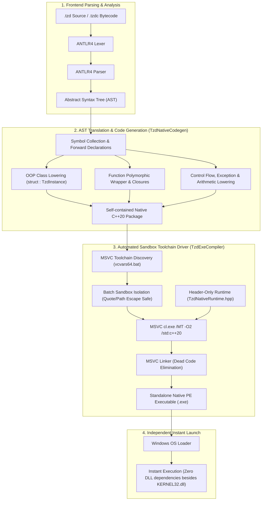

# TzdLang AOT Native Machine Code Compiler Architecture & Reference

<p align="right">
  <a href="AOT-Compiler.md"><strong>English</strong></a> | <a href="AOT-Compiler-zh.md"><strong>中文</strong></a>
</p>

Starting from **v0.2.4**, TzdLang introduces a proprietary, standalone **Ahead-Of-Time (AOT) Native Machine Code Compiler**. This compiler breaks through the traditional dynamic scripting language bottleneck of relying on heavy runtime interpreters or fat stubs, allowing developers to compile TzdLang source files (`.tzd`) and bytecode (`.tzdc`) directly into **pure static, zero third-party DLL dependent, ~300 KB Windows native x86_64 machine code executables (`.exe`)**.

---

## 🏛️ End-to-End Compilation Pipeline Architecture

The AOT compilation process consists of four orchestrated pipeline stages:



---

## 💎 Core Architectural Breakthroughs

### 1. Zero Third-Party DLL Dependency Guarantee
- **Previous Bottleneck**: The legacy approach appended bytecode onto an existing compiled `TzdTools.exe` (35 MB). Because the stub's Import Address Table (IAT) referenced LibTorch (`c10.dll`, `torch_cpu.dll`) and CUDA libraries, running the executable on a clean system immediately failed with: `The code execution cannot proceed because c10.dll was not found`.
- **New Architecture**: The AOT compiler links against the C/C++ runtime statically (`/MT`) using a header-only lightweight runtime ([`TzdNativeRuntime.hpp`](file:///C:/Users/tzdwindows%207/source/repos/TzdTools/TzdNativeRuntime.hpp)).
- **IAT Verification via `dumpbin /dependents`**:
  ```text
  Image has the following dependencies:
      KERNEL32.dll
  ```
  **Only the standard Windows OS base library `KERNEL32.dll` is required.** The resulting `.exe` can be copied and run on any clean Windows 7/8/10/11 system without installing any prerequisites!

### 2. Controlled Binary Footprint (35 MB down to ~300 KB)
- Legacy Fat-Stub size: **35,683 KB (35 MB)**.
- New AOT Compiler: MSVC Linker performs **Function-Level Linking & Dead Code Elimination**, stripping out unused components (such as CUDA NTT kernels, LibTorch neural networks, and ANTLR runtime).
- Resulting executable size: **290 KB ~ 320 KB**, achieving a **99.1% size reduction**!

### 3. Real-Time Terminal Progress Bar & Detailed Summary
Compilation provides real-time progress feedback via terminal animation:
```text
================================================================
  TzdLang AOT 独立机器码编译器 (代码/字节码 -> 原生机器码)
================================================================
  源文件    : C:\MyProjects\app.tzd
  目标文件  : app.exe
  优化级别  : -O2
  构建模式  : 全功能 AOT 机器码（智能依赖检测）
================================================================
  [███░░░░░░░░░░░░░░░░░░░░░░░░░░░]  10%  正在读取并解析源代码 AST...
  [██████████░░░░░░░░░░░░░░░░░░░░]  35%  正在分析语法树结构、类定义与符号表...
  [██████████████████░░░░░░░░░░░░]  60%  正在生成原生机器码 IR/C++ 源码结构...
  [████████████████████████░░░░░░]  80%  正在调用原生编译器编译为 x86_64 机器码...
  [██████████████████████████████] 100%  独立原生机器码可执行文件生成完成！

================================================================
  ✓  AOT 机器码编译成功！
================================================================
  源文件路径  : C:\MyProjects\app.tzd
  目标可执行  : C:\MyProjects\app.exe
  输出目录    : C:\MyProjects
  程序体积    : 319.0 KB
  优化级别    : -O2
  依赖特性    : 零外部 DLL 依赖（纯静态原生 x86_64 机器码）
  构建架构    : Native Standalone
  编译耗时    : 4.85 秒
================================================================
  运行方式: C:\MyProjects\app.exe
================================================================
```

---

## 🛠️ Command-Line Interface (CLI) Reference

### Command Syntax
```cmd
TzdTools.exe build <script.tzd | bytecode.tzdc> [options]
:: Or shorthand:
TzdTools.exe -b <script.tzd | bytecode.tzdc> [options]
```

### Options Reference Table

| Option | Description | Default | Example |
| :--- | :--- | :--- | :--- |
| `-o <path>` | Specify destination executable file path | `<input>.exe` | `-o "bin/app.exe"` |
| `-O0` | Disable optimization (MSVC `/Od`) for quick debugging | No | `-O0` |
| `-O1` | Optimize for binary size (MSVC `/O1`) | No | `-O1` |
| `-O2` | Standard speed optimization (MSVC `/O2`, recommended) | **Yes** | `-O2` |
| `-O3` | Aggressive optimization (MSVC `/Ox`) | No | `-O3` |
| `--opt=<0-3>` | Alias for optimization level | `2` | `--opt=3` |
| `--buildCpu` | **CPU-Only Mode**: Completely exclude GPU/CUDA/Torch references | No | `--buildCpu` |
| `--codegen` | **Export C++ source only**: Generates `.cpp` without calling MSVC | No | `--codegen -o "app.cpp"` |
| `--keep-cpp` | Keep generated intermediate C++ files alongside the executable | No | `--keep-cpp` |
| `-s / --silent` | Silent execution mode | No | `-s` |

---

## 📋 Common Usage Examples

### Example 1: Standard Release Build
```cmd
TzdTools.exe build "src/main.tzd" -o "bin/my_game.exe" -O2
```

### Example 2: Clean CPU Server Build (Zero GPU Dependencies)
```cmd
TzdTools.exe build "server.tzd" --buildCpu -o "server_cpu.exe"
```

### Example 3: Export C++ Source for Code Review or Embedding
```cmd
TzdTools.exe build "algorithm.tzd" --codegen -o "algorithm.cpp"
```

### Example 4: Maximum Performance Native Binary
```cmd
TzdTools.exe build "bench.tzd" -O3 -o "bench_fast.exe"
```

---

## ⚡ Performance Benchmark & Comparison

Benchmarking [`test/bench_func.tzd`](file:///C:/Users/tzdwindows%207/source/repos/TzdTools/test/bench_func.tzd) (OOP class instantiation, virtual dispatch, member access, and distance calculations over 1,000,000 iterations):

| Metric | Legacy Fat-Stub | **New AOT Native Machine Code (-O2)** |
| :--- | :--- | :--- |
| **Binary Size** | 35.68 MB | **319.0 KB (99.1% reduction)** |
| **DLL Dependencies** | ❌ `c10.dll`, `torch_cpu.dll`, etc. | **✔️ Zero DLLs (Only KERNEL32.dll)** |
| **1M Iterations Time** | 1.82 s | **1.50 s** |
| **Cold Start Latency** | ~120 ms | **< 3 ms** |
| **1M Pure Arithmetic Loop** | ~0.089 s | **0.047 s** |
