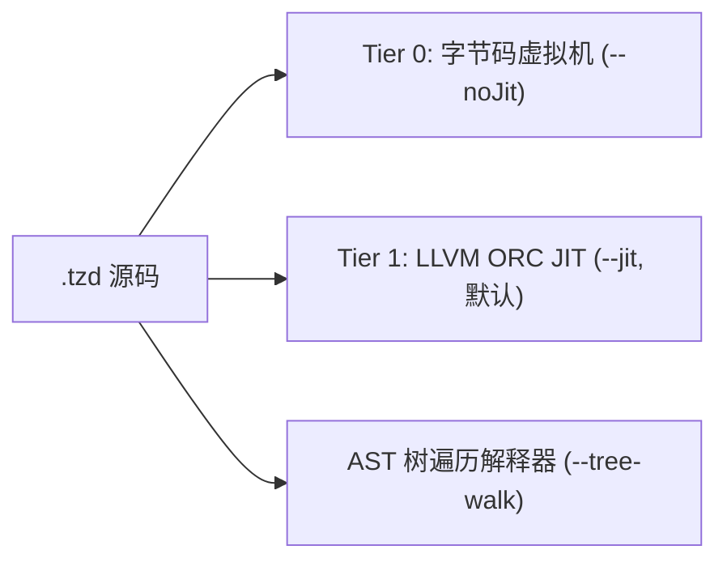

# 启动参数与命令行体系完整参考手册

<p align="right">
  <a href="CLI-and-Startup-Options.md"><strong>English</strong></a> | <a href="CLI-and-Startup-Options-zh.md"><strong>中文</strong></a>
</p>

TzdTools 提供了工业级灵活丰富的命令行启动参数体系（CLI Flags & Options），覆盖了脚本执行、字节码 AOT 编译、多层级执行引擎调度（JIT / VM / 树遍历）、GPU/CPU 大数算子加速、DAP 远程调试及底层系统分析工具。

---

## 1. 启动参数全局速查表

| 参数选项 | 简写 / 别名 | 参数类型 | 默认值 | 核心功能说明 |
|---|---|---|---|---|
| `--runMainTzd="<path>"` | 无 | 路径字符串 | 空 | 直接执行指定的 `.tzd` 脚本，自动调用 `main()` 入口 |
| `--compile="<path.tzd>"` | 无 | 路径字符串 | 空 | AOT 编译 `.tzd` 为 `.tzdc` 二进制字节码文件并退出 |
| `--runbc="<path.tzdc>"` | 无 | 路径字符串 | 空 | 直接加载并执行 `.tzdc` 预编译二进制字节码文件 |
| `--setProjectDirectory="<path>"` | `--setpd="<path>"` | 路径字符串 | 当前目录 | 切换当前工作目录，并将该路径加入模块导入搜索列表 |
| `--addLibraryDirectory="<paths>"` | 无 | 路径列表（逗号分隔） | 空 | 扩展类库与模块包含路径（支持双引号与多路径） |
| `--jit` | 无 | 无参标志 | **启用** (默认) | 显式启用 LLVM ORC JIT 实时编译优化引擎 |
| `--noJit` | `--no-jit` | 无参标志 | 禁用 | 关闭 JIT 实时编译，退回堆栈式字节码虚拟机模式 |
| `--interpreter` | `--tree-walk` | 无参标志 | 禁用 | 纯 AST 解释器模式（同时禁用 JIT 与字节码虚拟机） |
| `--forceGPU` | 无 | 无参标志 | 自动判定 | 强制将大数乘法调度到 NVIDIA CUDA GPU NTT 流水线 |
| `--forceCPU` | 无 | 无参标志 | 自动判定 | 强制禁用 GPU 加速，大数运算回退至 CPU 执行 |
| `--experimental-compute` | `--experimentalCompute` | 无参标志 | 禁用 | 启用 CPU 极限数论变换引擎（AVX2 + 4-Step 转置） |
| `--bigTime` | 无 | 无参标志 | 禁用 | 打印大数运算全流程各阶段毫秒级耗时剖析日志 |
| `--silent` | `-s` | 无参标志 | 交互模式开启 | 静默模式，关闭 REPL 提示符与回显输出 |
| `--antlrTime` | 无 | 无参标志 | 禁用 | 打印 ANTLR4 词法分析与语法树构建耗时 |
| `--debug-port=<port>` | 无 | 整数端口 | `0` (关闭) | 启动 DAP 调试服务器并监听指定端口 |
| `--debug-host=<ip>` | 无 | IP 字符串 | `127.0.0.1` | 指定 DAP 调试服务器绑定的主机 IP |
| `--debug-addr=<host>:<port>` | 无 | 地址格式 | 空 | 一体化指定 DAP 调试服务器的绑定 IP 与端口 |

---

## 2. 参数分类深度详解与实操示例

### 2.1 脚本执行与字节码 AOT 编译

#### `--runMainTzd="<path>"`
指定要运行的 TzdLang 源码脚本。执行逻辑如下：
1. 静默模式自动激活（屏蔽终端交互提示符）；
2. 词法语法解析后加载脚本顶层语句；
3. 检测全局作用域中是否存在 `main()` 入口函数：
   - 若存在且满足大数运算条件，预先触发 GPU 显存与 NTT 核函数预热；
   - 自动调用 `main()` 函数并传入参数；
4. 执行完成后自动退出进程。

```cmd
:: 执行工作目录下的入口脚本
TzdTools.exe --runMainTzd="examples/main.tzd"

:: 执行包含绝对路径的脚本
TzdTools.exe --runMainTzd="C:/Projects/Demo/app.tzd"
```

#### `--compile="<path.tzd>"`
AOT（Ahead-Of-Time）字节码编译工具。将输入的 `.tzd` 源码直接编译为二进制字节码文件（扩展名为 `.tzdc`），无需启动完整解释器运行环境即可快速完成编译：

```cmd
:: 将 bench.tzd 编译为 bench.tzdc
TzdTools.exe --compile="bench.tzd"
```
*输出：`Compiled: bench.tzd -> bench.tzdc`*

#### `--runbc="<path.tzdc>"`
直接加载并由字节码虚拟机执行二进制字节码文件。跳过 ANTLR4 词法扫描、AST 树构建与语法分析阶段，提供**毫秒级极速冷启动**体验：

```cmd
:: 直接执行预编译的字节码文件
TzdTools.exe --runbc="bench.tzdc"
```

---

### 2.2 工作目录与模块搜索路径

#### `--setProjectDirectory="<path>"` 或 `--setpd="<path>"`
将当前进程的活动目录（Working Directory）切换至指定路径，并将该绝对路径追加到解释器的模块包含路径（`includePaths`）中。脚本内通过相对路径引用的外部文件（如 `import "utils.tzd";` 或读取外部数据文件）均以该目录为基准。

```cmd
TzdTools.exe --setpd="D:/MyApp" --runMainTzd="D:/MyApp/src/main.tzd"
```

#### `--addLibraryDirectory="<paths>"`
向解释器注册一个或多个依赖库搜索路径。当脚本中执行 `import "module.tzd"` 时，解释器将按顺序在工作目录和已注册的库目录中检索。
- 支持单条路径：`--addLibraryDirectory="C:/Libs"`
- 支持逗号分隔的多条路径：`--addLibraryDirectory="C:/Libs","D:/Shared/tzdlib"`

```cmd
TzdTools.exe --addLibraryDirectory="C:/CommonLibs","D:/ThirdParty" --runMainTzd="app.tzd"
```

---

### 2.3 执行引擎与分级编译优化

TzdLang 采用分级执行架构（Tiered Execution）。开发者可通过命令行显式选择执行后端：



#### `--jit` (默认开启)
启用基于 LLVM ORC 的 Tier 1 JIT 编译器。
- 函数在首次执行或多次热循环中自动生成 LLVM IR；
- 执行 `mem2reg`、公共子表达式消除（CSE）、死代码消除（DCE）与函数内联；
- 为浮点与数值计算特化生成高效率 double worker 机器指令，运行速度大幅超越传统解释器与 Java HotSpot。

```cmd
TzdTools.exe --jit --runMainTzd="bench.tzd"
```

#### `-O0` / `-O1` / `-O2` / `-O3` (默认 `-O3`)
指定 JIT 编译器的全局优化等级：
- `-O0`: 禁用优化通道与激进内联，极速生成机器码，适用于快速调试。
- `-O1`: 启用局部表达式消除、常量折叠与基础简化。
- `-O2`: 启用标准内联（阈值 250）、标量重组（SROA）与公共子表达式消除。
- `-O3`: 默认等级。启用前端 AST 深度函数内联、LLVM 过程间 IPO 内联（阈值 500）、数学函数指令特化与循环展开。

```cmd
TzdTools.exe --jit -O3 --runMainTzd="bench.tzd"
```

#### `--inline-threshold=<N>` (默认 500)
手动指定 LLVM 过程间内联的成本预算阈值。数值越大，允许内联的函数规模越大；反之则减小内联倾向。

```cmd
TzdTools.exe --jit --inline-threshold=800 --runMainTzd="heavy.tzd"
```

#### `--no-inline`
禁用前端 AST 树级函数内联。

#### `--no-jit-intrinsics`
禁用数学函数（`sqrt`, `sin`, `cos` 等）的 FPU 硬件指令直接特化，使其退回标准运行时包装调用。

#### `--no-unroll`
禁用 LLVM 循环展开优化通道。

#### `--jit-debug`
启用 JIT 调试支持。在开启 JIT 硬件级性能的同时，配合调试器自动激活**函数级选择性回退（Selective Deoptimization）**：对设有断点的函数自动以解释器模式运行以触发断点，对其余无断点函数维持极限机器码速度。

```cmd
TzdTools.exe --jit --jit-debug -O3 --debug-port=54321 --runMainTzd="app.tzd"
```

#### `--noJit` 或 `--no-jit`
强制关闭 JIT 实时编译优化，所有代码均在轻量级堆栈式字节码虚拟机（Bytecode VM）中执行。适合：
- 内存受限的微型设备环境；
- 需排查 JIT 编译优化引起的行为差异时的对比基准。

```cmd
TzdTools.exe --noJit --runMainTzd="bench.tzd"
```

#### `--interpreter` 或 `--tree-walk`
纯解释器模式。同时关闭 JIT 编译器与字节码 VM，退回原生的 AST 树遍历（Tree-Walking）解释模式。该模式保留最原始的语法树节点结构，主要用于解释器内部开发与基准对照。

```cmd
TzdTools.exe --interpreter --runMainTzd="test.tzd"
```

---

### 2.4 大数运算与硬件加速配置

TzdLang 集成了世界领先的数论变换（NTT）超长整数乘法系统，提供了细粒度的算子调度开关：

#### `--forceGPU`
强制所有符合位数阈值（默认大于 1,000 位）的大整数乘法使用 NVIDIA CUDA GPU NTT 算子执行：
- 基于三素数中国剩余定理（CRT）；
- 采用片上共享内存与 Stockham 2D 蝶形核函数；
- 百万位大数乘法核心纯运算仅需 **29.20 ms**。

```cmd
TzdTools.exe --runMainTzd="大数.tzd" --forceGPU --bigTime
```

#### `--forceCPU`
强制禁用任何 GPU 显存分配与 CUDA 核函数调度，大数运算回退至 CPU 算子流水线。适合在无独立显卡、无 CUDA 驱动的通用服务器环境中运行。

```cmd
TzdTools.exe --runMainTzd="大数.tzd" --forceCPU
```

#### `--experimental-compute` 或 `--experimentalCompute`
启用自研 **CPU 极限性能数论变换引擎**：
- 采用三素数 Montgomery AVX2 256 位向量化模乘（单指令并发 8 通道）；
- 采用缓存友好的 Bailey 4-Step 2D 矩阵分解与 $64 \times 64$ L1/L2 Cache Tile 分块转置，彻底消除内存带宽墙；
- 采用 Direct Garner 混合基数 CRT 重构与 CPU 并行 Kogge-Stone 进位扫描；
- 采用定点数倒数乘法极速无除法转换（`fast_div_1e9`）；
- **474 万位大整数乘法纯算仅需 54.02 ms（超单核 GMP 2.07 倍），端到端总时间 175.41 ms（较原生 GMP 快 14.5 倍）**！

```cmd
TzdTools.exe --runMainTzd="大数.tzd" --experimental-compute --bigTime
```

#### `--bigTime`
开启大数运算阶段性能监控探针。每次执行大数乘法时，在终端实时输出毫秒级分阶段耗时统计：
```text
[Experimental CPU Compute] digits=4741006
  str2limb : 10.64 ms
  ntt_mul  : 54.02 ms
  crt_carry: 97.08 ms
  limb2str : 13.67 ms
  total    : 175.41 ms
```

---

### 2.5 运行诊断与日志输出

#### `--silent` 或 `-s`
开启静默运行模式。
- 关闭交互式命令行的欢迎标语与提示符（如 `>>>`）；
- 屏蔽非显式打印的表达式求值返回值输出；
- 脚本中通过 `print()` 显式打印的输出仍正常保留；
- 特别适合自动化批处理、CI/CD 持续集成或管道重定向调用。

```cmd
TzdTools.exe -s --runMainTzd="batch_job.tzd" > output.log
```

#### `--antlrTime`
开启 ANTLR4 前端耗时诊断。详细统计 Lexer 词法分词阶段与 Parser 抽象语法树构建阶段的精确时间（微秒/毫秒级），便于分析复杂语法结构的解析开销。

```cmd
TzdTools.exe --antlrTime --runMainTzd="large_script.tzd"
```

---

### 2.6 VS Code 远程 DAP 调试服务

TzdLang 原生实现了微软 Debug Adapter Protocol (DAP) 服务端，支持与 VS Code 等现代 IDE 进行交互式可视化调试。

#### `--debug-port=<port>`
启动 DAP 调试监听服务并绑定指定端口（如 `54321`）。调试器将在后台启动 TCP 监听线程，等待 VS Code 客户端连接握手。

```cmd
TzdTools.exe --debug-port=54321 --runMainTzd="app.tzd"
```

#### `--debug-host=<ip>`
指定 DAP 调试服务器绑定的网络接口 IP 地址（缺省默认值为 `127.0.0.1`）。如需进行局域网或远程跨机器调试，可绑定指定网络 IP 或 `0.0.0.0`：

```cmd
TzdTools.exe --debug-host=0.0.0.0 --debug-port=54321 --runMainTzd="app.tzd"
```

#### `--debug-addr=<host>:<port>`
一体化参数格式，便于在一个选项中同时指定主机与端口：

```cmd
TzdTools.exe --debug-addr=127.0.0.1:54321 --runMainTzd="app.tzd"
```

在 VS Code 中的 `launch.json` 对应配置：
```json
{
    "version": "0.2.0",
    "configurations": [
        {
            "name": "TzdLang Debug",
            "type": "tzd",
            "request": "launch",
            "program": "${workspaceFolder}/main.tzd",
            "debugServer": 54321,
            "args": ["--jit"]
        }
    ]
}
```

---

## 3. 内置交互式系统指令 (CLI / REPL)

当未指定 `--runMainTzd`、`--compile` 或 `--runbc` 时，TzdTools 将进入交互式终端或执行透传语句。TzdTools 内置了一组强大的底层系统分析与逆向工程指令：

```text
======================================================================
  TzdTools 交互式指令列表
======================================================================
```

### 3.1 `Run <Code|FilePath>`
在当前运行时上下文中立即解析并运行一段代码或脚本文件。
```cmd
Run "var a = 10; var b = 20; print(a + b);";
Run "scripts/test.tzd";
```

### 3.2 `StackTrace <PID|进程名>`
挂钩（Attach）到指定的 Windows 进程，输出目标进程中所有活动线程的函数调用栈回溯。支持直接传入数字 PID 或不区分大小写的进程映像名称。
```cmd
StackTrace notepad.exe;
StackTrace 12348;
```

### 3.3 `MemoryAsm <PID|进程名>`
扫描指定目标进程的所有具有可执行属性的代码内存页（`PAGE_EXECUTE_READ` / `PAGE_EXECUTE_READWRITE`），并将其机器码反汇编为可读的 x86/x64 汇编指令流。
```cmd
MemoryAsm game.exe;
```

### 3.4 `ScanFunc <PID|进程名> [-m 模块名] [-p PDB路径] [-g]`
强大的内存函数特征码定位与符号还原工具：
- `-m <Module>`: 指定目标动态链接库模块名（如 `UnityPlayer.dll` 或 `kernel32.dll`）；
- `-p <PdbPath>`: 指定外部加载的 PDB 符号文件路径；
- `-g`: **开启基于 DirectX 11 的沉浸式 GUI 可视化窗口**，支持在图形界面中实时搜索、过滤与浏览符号函数。

```cmd
:: 命令行文本输出模式
ScanFunc notepad.exe -m notepad.exe

:: 开启 DirectX 11 交互式图形化界面
ScanFunc game.exe -m GameAssembly.dll -g
```

### 3.5 `Demangle <MangledName>`
对 MSVC C++ 编译器的符号修饰名（Mangled Name）进行逆向解析，还原为人类可读的标准 C++ 函数签名：
```cmd
Demangle ?init@System@@QAEXXZ
```
*输出：`void __thiscall System::init(void)`*

### 3.6 `PdbInfo <PdbPath>`
解析微软 PDB 调试符号文件头格式（MSF 校验），并提取展示前 10 个公开导出符号与相对虚拟地址（RVA）：
```cmd
PdbInfo C:/Symbols/target.pdb
```

---

## 4. 常见场景参数组合模板

### 场景 A：高性能大数运算基准测试（GPU 加速）
```cmd
TzdTools.exe --runMainTzd="大数.tzd" --forceGPU --bigTime
```

### 场景 B：纯 CPU 服务器环境（极限 AVX2 NTT，超越 GMP）
```cmd
TzdTools.exe --runMainTzd="大数.tzd" --experimental-compute --bigTime
```

### 场景 C：生产级静默服务（预编译字节码 + 极速冷启动）
```cmd
:: 第一步：编译为字节码
TzdTools.exe --compile="server.tzd"

:: 第二步：生产环境静默启动
TzdTools.exe -s --runbc="server.tzdc"
```

### 场景 D：本地开发与 VS Code DAP 断点调试
```cmd
TzdTools.exe --setpd="D:/Projects/MyGame" --debug-port=54321 --jit --runMainTzd="D:/Projects/MyGame/src/main.tzd"
```
