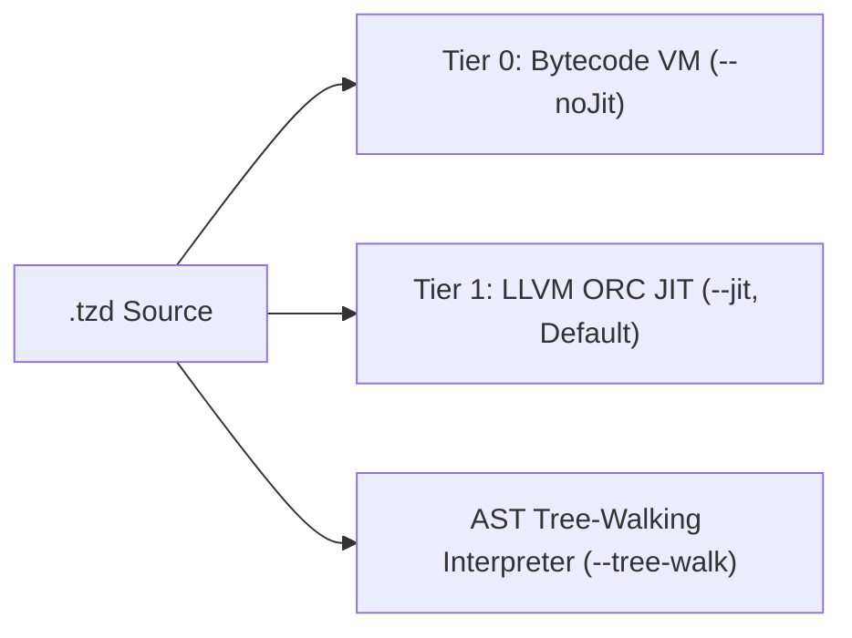

# CLI Flags & Startup Parameters Reference Manual

<p align="right">
  <a href="CLI-and-Startup-Options.md"><strong>English</strong></a> | <a href="CLI-and-Startup-Options-zh.md"><strong>中文</strong></a>
</p>

TzdTools provides an extensive, production-grade set of command-line flags and startup options. These cover script execution, ahead-of-time (AOT) bytecode compilation, tiered execution engine selection (JIT / VM / tree-walking), GPU/CPU BigInt arithmetic acceleration, remote DAP debugging, and low-level system diagnostic tools.

---

## 1. Global CLI Flags Quick Reference

| Option | Shorthand / Alias | Type | Default | Description |
|---|---|---|---|---|
| `--runMainTzd="<path>"` | None | Path string | Empty | Runs specified `.tzd` script and calls `main()` entrypoint |
| `--compile="<path.tzd>"` | None | Path string | Empty | AOT compiles `.tzd` into `.tzdc` binary bytecode and exits |
| `--runbc="<path.tzdc>"` | None | Path string | Empty | Directly loads and executes `.tzdc` binary bytecode file |
| `--setProjectDirectory="<path>"` | `--setpd="<path>"` | Path string | Current directory | Sets working directory and adds it to module import search paths |
| `--addLibraryDirectory="<paths>"` | None | Path list (comma-separated) | Empty | Extends library search paths (supports quotes and multi-paths) |
| `--jit` | None | Flag | **Enabled** (default) | Explicitly enables Tier 1 LLVM ORC JIT execution engine |
| `--noJit` | `--no-jit` | Flag | Disabled | Disables JIT, falling back to stack-based Bytecode VM |
| `--interpreter` | `--tree-walk` | Flag | Disabled | Pure AST tree-walking interpreter (disables both JIT & VM) |
| `--forceGPU` | None | Flag | Auto-detect | Forces BigInt multiplications to NVIDIA CUDA GPU NTT pipeline |
| `--forceCPU` | None | Flag | Auto-detect | Disables GPU acceleration, forcing CPU-only BigInt arithmetic |
| `--experimental-compute` | `--experimentalCompute` | Flag | Disabled | Enables CPU high-performance NTT engine (AVX2 + 4-step transpose) |
| `--bigTime` | None | Flag | Disabled | Prints detailed millisecond-level breakdown of BigInt operations |
| `--silent` | `-s` | Flag | Interactive on | Silent mode, suppressing REPL prompts and non-explicit prints |
| `--antlrTime` | None | Flag | Disabled | Prints ANTLR4 lexer and parser execution timings |
| `--debug-port=<port>` | None | Integer port | `0` (off) | Starts DAP debug server listening on specified port |
| `--debug-host=<ip>` | None | IP string | `127.0.0.1` | Sets DAP debug server bind IP address |
| `--debug-addr=<host>:<port>` | None | Address string | Empty | Combined host and port for DAP debug server |

---

## 2. Parameter Categories & Usage Examples

### 2.1 Script Execution & AOT Bytecode Compilation

#### `--runMainTzd="<path>"`
Specifies the `.tzd` script to execute:
1. Silent mode automatically activates (terminal prompts suppressed);
2. Top-level statements execute after lexing and parsing;
3. If a global `main()` function exists:
   - Automatically pre-warms GPU memory and kernels if BigInt workloads are detected;
   - Calls `main()` with script arguments;
4. The process terminates cleanly upon completion.

```cmd
:: Run main script from project directory
TzdTools.exe --runMainTzd="examples/main.tzd"

:: Run using absolute path
TzdTools.exe --runMainTzd="C:/Projects/Demo/app.tzd"
```

#### `--compile="<path.tzd>"`
Ahead-Of-Time (AOT) bytecode compiler. Compiles `.tzd` source code into binary bytecode (`.tzdc`), without spinning up the execution engine:

```cmd
:: Compile bench.tzd into bench.tzdc
TzdTools.exe --compile="bench.tzd"
```
*Output: `Compiled: bench.tzd -> bench.tzdc`*

#### `--runbc="<path.tzdc>"`
Directly executes precompiled `.tzdc` bytecode files. Bypasses ANTLR4 lexing, AST construction, and parsing, providing **sub-millisecond cold start times**:

```cmd
:: Execute bytecode directly
TzdTools.exe --runbc="bench.tzdc"
```

---

### 2.2 Working Directory & Library Paths

#### `--setProjectDirectory="<path>"` or `--setpd="<path>"`
Sets the active working directory of the process and adds it to the interpreter's module search paths (`includePaths`). All relative paths in scripts (e.g. `import "utils.tzd";` or reading local files) resolve against this directory.

```cmd
TzdTools.exe --setpd="D:/MyApp" --runMainTzd="D:/MyApp/src/main.tzd"
```

#### `--addLibraryDirectory="<paths>"`
Registers one or more library search directories. When scripts call `import "module.tzd"`, the engine searches working directories and registered library directories in order.
- Single path: `--addLibraryDirectory="C:/Libs"`
- Comma-separated paths: `--addLibraryDirectory="C:/Libs","D:/Shared/tzdlib"`

```cmd
TzdTools.exe --addLibraryDirectory="C:/CommonLibs","D:/ThirdParty" --runMainTzd="app.tzd"
```

---

### 2.3 Execution Tiers & JIT Optimizations

TzdLang implements a tiered hybrid execution model:



#### `--jit` (Default)
Enables the Tier 1 LLVM ORC JIT compiler:
- Generates LLVM IR dynamically for functions;
- Runs LLVM optimization passes (`mem2reg`, CSE, DCE, inlining);
- Specializes arithmetic loops into native machine code (double workers), outperforming JVM HotSpot C2.

```cmd
TzdTools.exe --jit --runMainTzd="bench.tzd"
```

#### `--noJit` or `--no-jit`
Disables JIT compilation, running everything in the compact stack-based Bytecode VM. Ideal for:
- Memory-constrained embedded environments;
- Verifying code behavior without JIT optimization transforms.

```cmd
TzdTools.exe --noJit --runMainTzd="bench.tzd"
```

#### `--interpreter` or `--tree-walk`
Pure AST tree-walking interpreter mode. Both JIT and Bytecode VM are bypassed. Useful for engine compiler testing and differential diagnostics.

```cmd
TzdTools.exe --interpreter --runMainTzd="test.tzd"
```

---

### 2.4 BigInt Arithmetic & Hardware Acceleration

TzdLang incorporates world-leading Number Theoretic Transform (NTT) BigInt acceleration:

#### `--forceGPU`
Forces all large BigInt multiplications (>1,000 digits) to execute on NVIDIA CUDA GPUs via custom 3-prime NTT kernels:
- Computes **4.74-million-digit** multiplication in **29.20 ms** pure GPU time.

```cmd
TzdTools.exe --runMainTzd="大数.tzd" --forceGPU --bigTime
```

#### `--forceCPU`
Disables CUDA GPU dispatching entirely. BigInt operations run on the host CPU.

```cmd
TzdTools.exe --runMainTzd="大数.tzd" --forceCPU
```

#### `--experimental-compute` or `--experimentalCompute`
Enables the high-performance **CPU NTT BigInt Engine**:
- 3-Prime Montgomery AVX2 256-bit SIMD vectorization (8 lanes per instruction);
- Bailey's 4-Step 2D matrix decomposition with $64 \times 64$ L1/L2 cache-blocked tiling;
- Direct Garner mixed-radix CRT and parallel Kogge-Stone carry propagation;
- Fixed-point reciprocal division (`fast_div_1e9`) eliminating hardware division;
- **Multiplies 4.74M digits in 54.02 ms pure / 175.41 ms end-to-end (2.07x faster pure compute than single-core GMP, 14.5x faster end-to-end)**!

```cmd
TzdTools.exe --runMainTzd="大数.tzd" --experimental-compute --bigTime
```

#### `--bigTime`
Prints millisecond-level phase breakdowns for BigInt operations:
```text
[Experimental CPU Compute] digits=4741006
  str2limb : 10.64 ms
  ntt_mul  : 54.02 ms
  crt_carry: 97.08 ms
  limb2str : 13.67 ms
  total    : 175.41 ms
```

---

### 2.5 Diagnostics & Output Controls

#### `--silent` or `-s`
Activates silent mode:
- Suppresses REPL banners and interactive prompts (`>>>`);
- Suppresses printing of expression return values;
- Preserves explicit `print()` statement output.

```cmd
TzdTools.exe -s --runMainTzd="batch.tzd" > log.txt
```

#### `--antlrTime`
Prints diagnostic timing for ANTLR4 lexical analysis (tokenizing) and syntax tree generation.

```cmd
TzdTools.exe --antlrTime --runMainTzd="script.tzd"
```

---

### 2.6 Remote VS Code DAP Debugging Server

TzdTools natively implements Microsoft's Debug Adapter Protocol (DAP):

#### `--debug-port=<port>`
Spins up a DAP debug server on the specified TCP port:

```cmd
TzdTools.exe --debug-port=54321 --runMainTzd="app.tzd"
```

#### `--debug-host=<ip>`
Sets the bind address for the DAP debug server (defaults to `127.0.0.1`). Use `0.0.0.0` for remote cross-host debugging.

```cmd
TzdTools.exe --debug-host=0.0.0.0 --debug-port=54321 --runMainTzd="app.tzd"
```

#### `--debug-addr=<host>:<port>`
Combined host and port argument:

```cmd
TzdTools.exe --debug-addr=127.0.0.1:54321 --runMainTzd="app.tzd"
```

VS Code `launch.json` configuration:
```json
{
    "version": "0.2.0",
    "configurations": [
        {
            "name": "TzdLang Debug",
            "type": "tzd",
            "request": "launch",
            "program": "${workspaceFolder}/main.tzd",
            "debugServer": 54321,
            "args": ["--jit"]
        }
    ]
}
```

---

## 3. Built-in System Commands (Interactive REPL / CLI)

When no script is passed, TzdTools launches the interactive REPL with system diagnostics:

### 3.1 `Run <Code|FilePath>`
Executes code or script in the current runtime context.
```cmd
Run "var a = 10; var b = 20; print(a + b);";
Run "scripts/test.tzd";
```

### 3.2 `StackTrace <PID|ProcessName>`
Attaches to a Windows process and prints call stacks for all active threads.
```cmd
StackTrace notepad.exe;
StackTrace 12348;
```

### 3.3 `MemoryAsm <PID|ProcessName>`
Disassembles executable memory pages (`PAGE_EXECUTE_READ` / `PAGE_EXECUTE_READWRITE`) into x86/x64 assembly.
```cmd
MemoryAsm game.exe;
```

### 3.4 `ScanFunc <PID|ProcessName> [-m Module] [-p PdbPath] [-g]`
Locates functions via bytecode signatures and restores symbols. Use `-g` to launch a **DirectX 11 GUI interface**.
```cmd
ScanFunc notepad.exe -m notepad.exe
ScanFunc game.exe -m GameAssembly.dll -g
```

### 3.5 `Demangle <MangledName>`
Demangles MSVC C++ mangled symbols into human-readable signatures:
```cmd
Demangle ?init@System@@QAEXXZ
```
*Output: `void __thiscall System::init(void)`*

### 3.6 `PdbInfo <PdbPath>`
Validates PDB format and extracts public symbols:
```cmd
PdbInfo C:/Symbols/target.pdb
```

---

## 4. Common Scenario Templates

### Scenario A: High-Performance GPU BigInt Benchmark
```cmd
TzdTools.exe --runMainTzd="大数.tzd" --forceGPU --bigTime
```

### Scenario B: Pure CPU Server (AVX2 Hardware-Limit NTT, beating GMP)
```cmd
TzdTools.exe --runMainTzd="大数.tzd" --experimental-compute --bigTime
```

### Scenario C: Production Silent Runner (Bytecode AOT + Fast Cold Start)
```cmd
TzdTools.exe --compile="server.tzd"
TzdTools.exe -s --runbc="server.tzdc"
```

### Scenario D: Local Development & VS Code Breakpoint Debugging
```cmd
TzdTools.exe --setpd="D:/Projects/MyGame" --debug-port=54321 --jit --runMainTzd="D:/Projects/MyGame/src/main.tzd"
```
