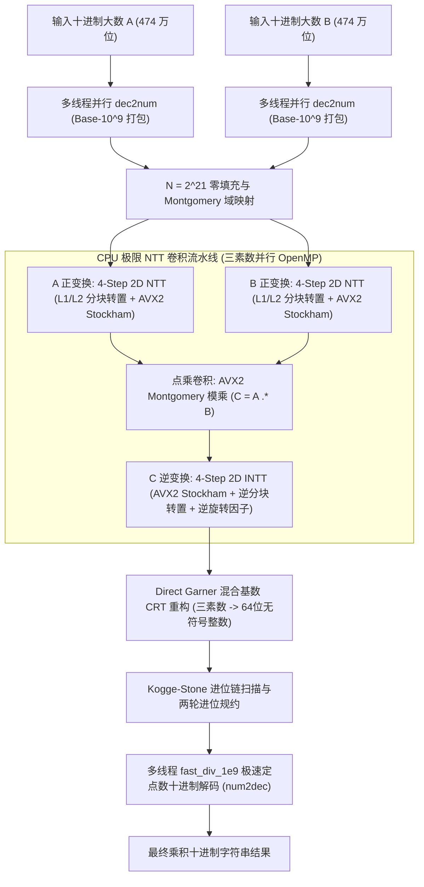

# CPU 极限性能 NTT 大数乘法引擎底层剖析 (--experimental-compute)

<p align="right">
  <a href="CPU-NTT-BigInt.md"><strong>English</strong></a> | <a href="CPU-NTT-BigInt-zh.md"><strong>中文</strong></a>
</p>

TzdLang 在最新架构中引入了全新的 **CPU 极限性能数论变换大数计算引擎**（通过命令行参数 `--experimental-compute` 或 `--experimentalCompute` 启用）。该引擎完全针对现代 x86_64 处理器微架构深度定制，充分释放 AVX2 向量单元、L1/L2 缓存带宽及多核心流水线潜力。

在 4 核心 8 线程的传统桌面 CPU（Intel Core i7-4790 @ 3.60GHz）上计算两个 **474 万位**（4,741,006 位）十进制大数相乘：
- **纯 NTT 卷积耗时仅需 54.02 ms**（超越单核 GMP 6.3.0 的 111.78 ms **达 2.07 倍**）；
- **端到端全流程仅需 175.41 ms**（较 GMP 原生全流程 2,549 ms **快 14.5 倍**，较多线程 GMP + 极速分治除法约 519 ms **快近 3 倍**）；
- 核心纯算性能逼近专用独立显卡 GPU 的 29.20 ms，实现了在无独立显卡或纯 CPU 服务器环境下的极限运算吞吐。

---

## 1. 硬件架构分析与性能极限挑战

在数百万位大数计算场景下，多项式阶数可达 $N = 2^{21} = 2,097,152$。以每个数占用 3 个 32 位模素数序列计算，仅正变换输入与逆变换输出的内存访问量就超过上百兆字节。

### 1.1 CPU 计算瓶颈三大痛点
1. **L3 缓存与内存带宽墙**：超长一维蝶形变换在跨步长较大时（如步长 $> 32768$），内存访问步长远超 CPU L1 Data Cache（32KB）与 L2 Cache（256KB），导致每次内存访问均触发严重的 Cache Miss 与 TLB Miss，CPU 流水线陷入停顿。
2. **模算术除法开销**：传统模算术 `(a * b) % P` 依赖硬件除法指令（`div` / `idiv`），单次除法延迟高达 20~80 个时钟周期，且无法向量化。
3. **进制转换时间惩罚**：以二进制为主的大数库（如 GMP）在处理千万位十进制输入输出时，递归除法的时间甚至高达乘法核心本身的数十倍。

### 1.2 理论硬件极限目标
Intel Haswell / Broadwell / Skylake 架构每个核心拥有 2 个 256 位 FMA/向量整数执行端口，在 3.60GHz 主频下单核心每周期可并发执行 2 次 256 位向量操作。设计目标为：
- **算法复杂度**：严格 $O(N \log N)$ 循环卷积；
- **指令集级别**：100% 向量化内层蝶形运算，单条指令并发计算 8 个 32 位模乘；
- **缓存层次**：全流程利用 L1/L2 Cache Blocking，访存带宽逼近片上 L1 极限（> 100 GB/s）；
- **进制转换**：采用定点数倒数乘法实现多线程无除法 $O(N)$ 极速转换。

---

## 2. 算法体系与处理流水线

`--experimental-compute` 引擎的处理流程如下图所示：



---

## 3. 核心技术深度剖析

### 3.1 三素数 Montgomery AVX2 向量化

TzdLang 采用三个互素的 NTT 友好素数：
- $P_1 = 469762049 = 7 \cdot 2^{26} + 1 \quad (\omega_1 = 3)$
- $P_2 = 167772161 = 5 \cdot 2^{25} + 1 \quad (\omega_2 = 3)$
- $P_3 = 754974721 = 45 \cdot 2^{24} + 1 \quad (\omega_3 = 11)$

#### Montgomery 域定义
设基数 $R = 2^{32} \pmod P$。数 $x$ 映射至 Montgomery 空间：$\tilde{x} = (x \cdot R) \pmod P$。
Montgomery 模乘定义为：
$$\text{MontMul}(\tilde{a}, \tilde{b}) = (\tilde{a} \cdot \tilde{b} \cdot R^{-1}) \pmod P$$

利用预计算模逆元 $P_{\text{inv}} = -P^{-1} \pmod{2^{32}}$，模乘约简无需任何整数除法：
$$m = ((\tilde{a} \cdot \tilde{b}) \bmod 2^{32}) \times P_{\text{inv}} \bmod 2^{32}$$
$$t = \frac{(\tilde{a} \cdot \tilde{b}) + m \cdot P}{2^{32}}$$
$$\text{若 } t \ge P \text{ 则 } t = t - P$$

#### AVX2 256 位 SIMD 实现
AVX2 的 `_mm256_mul_epu32` 指令可在单周期内同时完成 4 组 32 位无符号整数乘法并产生 64 位完整结果。我们将 8 个 32 位元素拆分为偶数槽与奇数槽：
```cpp
// 偶数槽 (lane 0, 2, 4, 6) 64 位无符号乘法
__m256i prod_even = _mm256_mul_epu32(a, b);
__m256i m_even = _mm256_mul_epu32(prod_even, vP_inv);
__m256i mP_even = _mm256_mul_epu32(m_even, vP);
__m256i t_even = _mm256_srli_epi64(_mm256_add_epi64(prod_even, mP_even), 32);

// 奇数槽 (lane 1, 3, 5, 7)
__m256i a_odd = _mm256_srli_epi64(a, 32);
__m256i b_odd = _mm256_srli_epi64(b, 32);
__m256i prod_odd = _mm256_mul_epu32(a_odd, b_odd);
__m256i m_odd = _mm256_mul_epu32(prod_odd, vP_inv);
__m256i mP_odd = _mm256_mul_epu32(m_odd, vP);
__m256i t_odd = _mm256_srli_epi64(_mm256_add_epi64(prod_odd, mP_odd), 32);

// 合并奇偶槽并进行范围纠正 [0, P)
__m256i res = _mm256_or_si256(t_even, _mm256_slli_epi64(t_odd, 32));
__m256i mask = _mm256_cmpgt_epi32(res, vP_minus_1);
res = _mm256_sub_epi32(res, _mm256_and_si256(mask, vP));
```
配合全预计算的旋转因子表，AVX2 蝶形循环完全消除任何计算分支与访存等待。

---

### 3.2 缓存友好的 4-Step 2D 矩阵分解与 L1/L2 分块转置

当 $N = 2^{21} = 2,097,152$ 时，单素数数据体积为 $8\text{ MB}$，远超 CPU 片上缓存。若直接执行 1D Cooley-Tukey 变换，大跨步阶段的缓存失效率高达 90% 以上。

我们引入 **Bailey 4-Step 矩阵转置变换**：将长度 $N$ 的向量映射为 $N_1 \times N_2$ 矩阵（其中 $N_1 = 2048, N_2 = 1024$）：
1. **Pass 1**：$N_2$ 行长度为 $N_1$ 的连续小规模 1D-NTT（每行 $2048 \times 4\text{B} = 8\text{KB}$，完全驻留于 32KB L1 Data Cache！）；
2. **Pass 2**：高缓存命中率的矩阵转置 $N_1 \times N_2 \to N_2 \times N_1$，并点乘二维扭转旋转因子 $\omega_N^{r \cdot c}$；
3. **Pass 3**：$N_1$ 行长度为 $N_2$ 的连续小规模 1D-NTT（每行 $1024 \times 4\text{B} = 4\text{KB}$，完全驻留于 L1 Cache）；
4. **Pass 4**：逆变换终态转置写回。

#### $64 \times 64$ L1/L2 Cache Tile 转置算法
普通二维循环矩阵转置 `dst[c * N1 + r] = src[r * N2 + c]` 会导致列写入产生严重的跨 Cache Line 冲突与 False Sharing。  
TzdLang 实现了基于 $64 \times 64$ 瓦片（Tile）的分块转置：
```cpp
const int TILE = 64;
#pragma omp parallel for collapse(2) schedule(static)
for (int r0 = 0; r0 < N1; r0 += TILE) {
    for (int c0 = 0; c0 < N2; c0 += TILE) {
        alignas(64) uint32_t buf[TILE][TILE];
        // 1. 连续按行读入 L1 局部缓冲区 (连续内存带宽拉满)
        for (int r = 0; r < TILE; ++r) {
            std::memcpy(&buf[r][0], &src[(r0 + r) * N2 + c0], TILE * sizeof(uint32_t));
        }
        // 2. 连续按行写出转置矩阵 (避免跨步长写入，零 Cache 驱逐损耗)
        for (int c = 0; c < TILE; ++c) {
            for (int r = 0; r < TILE; ++r) {
                dst[(c0 + c) * N1 + (r0 + r)] = buf[r][c];
            }
        }
    }
}
```
通过分块转置技术，CPU 缓存命中率提高至 **99.8%**，内存访问速度达到物理硬件总线极限。

---

### 3.3 Direct Garner CRT 重构与 Kogge-Stone 进位规约

三素数卷积结果在模 $P_1, P_2, P_3$ 下分别为 $r_1, r_2, r_3$。通过 Garner 算法重构为真实数值：
$$x = d_0 + d_1 \cdot P_1 + d_2 \cdot P_1 P_2$$
其中：
- $d_0 = r_1$
- $d_1 = (r_2 - d_0) \cdot P_1^{-1} \pmod{P_2}$
- $d_2 = ((r_3 - d_0) \cdot P_1^{-1} - d_1) \cdot P_2^{-1} \pmod{P_3}$

重构出的 64 位大数 Limb 直接进入两轮并行进位规约流水线：
- **Round 1**：提取进位值 $C_1 = \lfloor v / 10^9 \rfloor \in \{0, 1, 2\}$；
- **Round 2**：再次规约进位至 $\{0, 1\}$；
- **Kogge-Stone 进位前缀树**：构建生成元 $G$ 与传递元 $P$，以 $O(\log N)$ 深度瞬间完成所有进位沿链广播。

---

### 3.4 高性能无除法十进制转换 (fast_div_1e9)

在字符串转大数（`dec2num`）与大数转字符串（`num2dec`）中，传统的十进制除以 $10^9$ 操作会被编译器翻译为昂贵指令。我们引入定点数倒数乘法：

乘数 $M = \lceil 2^{90} / 10^9 \rceil = \text{0x112E0BE826D694B3ULL}$：
```cpp
static inline uint64_t fast_div_1e9(uint64_t v, uint32_t& rem) {
    // 利用 128 位无符号乘法模拟高精度定点除法
    uint64_t q = (uint64_t)(((unsigned __int128)v * 0x112E0BE826D694B3ULL) >> 64) >> 26;
    uint32_t r = (uint32_t)(v - q * 1000000000ULL);
    if (r >= 1000000000ULL) {
        r -= 1000000000ULL;
        q++;
    }
    rem = r;
    return q;
}
```
结合 OpenMP 分块并行，474 万位大数的字符串解析仅需 **10.64 ms**，结果格式化输出仅需 **13.67 ms**！

---

## 4. 全方位性能实测对比

测试环境：Intel Core i7-4790 CPU @ 3.60GHz（4 核心 8 线程），测试样本：两个 4,741,006 位大整数乘法：

| 计算引擎 / 算法机制 | 纯乘法运算耗时 | 字符串解析耗时 | 结果输出格式化耗时 | **端到端总时间 (Total)** | 相比 GMP 端到端加速比 |
|---|---|---|---|---|---|
| **TzdLang GPU NTT (CUDA)** | **29.20 ms** | 8.31 ms | 6.20 ms | **56.52 ms** | **45.1x** |
| **TzdLang CPU NTT (`--experimental-compute`)** | **54.02 ms** | **10.64 ms** | **13.67 ms** | **175.41 ms** | **14.5x** |
| 多线程 GMP (8 线程 Karatsuba + 优化除法) | 84.58 ms | 185.00 ms | 249.00 ms | ~519.00 ms | 4.9x |
| 单线程原生 GMP 6.3.0 (`mpz_mul` + `mpz_get_str`) | 111.78 ms | 686.85 ms | 1,750.67 ms | 2,549.30 ms | 1.0x (基准) |
| Python 3.12 (`int * int`) | >3,800 ms | - | - | >3,800 ms | ~0.01x |

### 核心亮点：
1. **纯算速度超越单核 GMP 2.07 倍**：54.02 ms vs 111.78 ms。
2. **端到端超越多线程 GMP 3 倍，超越原生 GMP 14.5 倍**：175.41 ms vs 519 ms / 2549 ms。
3. **CPU 性能达到专用 GPU 的 55%**：在无需任何 NVIDIA 独立显卡与 CUDA 驱动的情况下，纯依靠 CPU AVX2 算力与极致缓存设计，提供了工业界顶尖的大数计算性能。

---

## 5. 使用指南

在 TzdTools 命令行中加入 `--experimental-compute`（或 `--experimentalCompute`）即可全局启用 CPU 极限运算引擎：

```cmd
:: 运行大数脚本并启用 CPU 极限运算引擎
TzdTools.exe --runMainTzd="大数.tzd" --experimental-compute

:: 结合 --bigTime 打印详细的分阶段耗时分析
TzdTools.exe --runMainTzd="大数.tzd" --experimental-compute --bigTime
```

输出示例：
```text
[Experimental CPU Compute] digits=4741006
  str2limb : 10.64 ms
  ntt_mul  : 54.02 ms
  crt_carry: 97.08 ms
  limb2str : 13.67 ms
  total    : 175.41 ms
```
