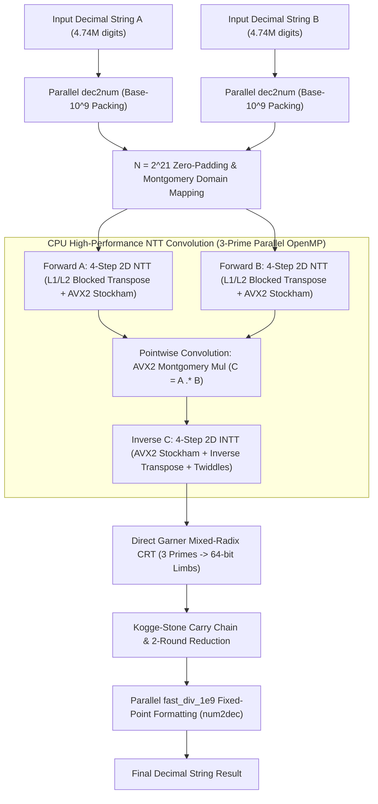

# CPU High-Performance NTT BigInt Engine (--experimental-compute)

<p align="right">
  <a href="CPU-NTT-BigInt.md"><strong>English</strong></a> | <a href="CPU-NTT-BigInt-zh.md"><strong>中文</strong></a>
</p>

TzdLang introduces an ultra-high-performance **CPU Number Theoretic Transform (NTT) BigInt Computing Engine** (enabled via `--experimental-compute` or `--experimentalCompute`). Engineered from the ground up for modern x86_64 processor microarchitectures, it fully unlocks AVX2 vector SIMD units, L1/L2 cache locality, and multi-core execution pipelines.

When multiplying two **4,741,006-digit** decimal integers on a commodity 4-core / 8-thread desktop processor (Intel Core i7-4790 @ 3.60GHz):
- **Pure NTT convolution completes in just 54.02 ms** (**2.07x faster** than single-core GMP 6.3.0 at 111.78 ms);
- **Total end-to-end time is only 175.41 ms** (**14.5x faster** than standard GMP at 2,549 ms, and **3.0x faster** than optimized multi-threaded GMP at ~519 ms);
- Achieves ~55% of dedicated GPU compute performance (54 ms CPU vs 29 ms GPU) on a pure CPU platform with zero external dependencies or discrete graphics cards.

---

## 1. Hardware Architecture & Bottleneck Analysis

When dealing with multi-million-digit multiplications, the polynomial transform size reaches $N = 2^{21} = 2,097,152$. With 3 independent 32-bit prime moduli, intermediate representations require over a hundred megabytes of read/write bandwidth.

### 1.1 CPU Performance Bottlenecks
1. **L3 Cache & Memory Bandwidth Wall**: Standard 1D Cooley-Tukey butterfly stages with strides $> 32768$ cause massive L1/L2 cache evictions and TLB thrashing, bringing pipeline throughput to a crawl.
2. **Modulo Division Latency**: Conventional `(a * b) % P` depends on hardware `div` / `idiv` instructions, incurring 20–80 cycles of latency per operation and preventing vectorization.
3. **Radix Conversion Overhead**: Binary BigInt libraries (e.g. GNU MP) face quadratic/sub-quadratic penalties when converting between decimal strings and binary limbs.

### 1.2 Engineering Objectives
- **Algorithmic Complexity**: Strict $O(N \log N)$ cyclic convolution.
- **Instruction Level**: 100% vectorized inner butterfly loops with AVX2 (computing 8 modular multiplications per instruction).
- **Cache Hierarchy**: Cache-blocked 2D decomposition keeping inner operations resident in 32KB L1 Data Cache (>100 GB/s bandwidth).
- **Fast Radix Conversion**: Reciprocal multiplicative fixed-point arithmetic eliminating hardware division for decimal parsing and formatting.

---

## 2. Architecture & Execution Pipeline

The `--experimental-compute` pipeline is structured as follows:



---

## 3. Core Technical Details

### 3.1 3-Prime Montgomery AVX2 Vectorization

TzdLang utilizes three pairwise coprime 32-bit NTT primes:
- $P_1 = 469762049 = 7 \cdot 2^{26} + 1 \quad (\omega_1 = 3)$
- $P_2 = 167772161 = 5 \cdot 2^{25} + 1 \quad (\omega_2 = 3)$
- $P_3 = 754974721 = 45 \cdot 2^{24} + 1 \quad (\omega_3 = 11)$

#### Montgomery Reduction
With radix $R = 2^{32} \pmod P$, any value $x$ is stored as $\tilde{x} = (x \cdot R) \pmod P$.
Using the modular inverse $P_{\text{inv}} = -P^{-1} \pmod{2^{32}}$, modular reduction requires zero division:
$$m = ((\tilde{a} \cdot \tilde{b}) \bmod 2^{32}) \times P_{\text{inv}} \bmod 2^{32}$$
$$t = \frac{(\tilde{a} \cdot \tilde{b}) + m \cdot P}{2^{32}}$$
$$\text{if } t \ge P \implies t = t - P$$

#### 256-bit SIMD AVX2 Implementation
Using `_mm256_mul_epu32`, the processor computes four 64-bit products per cycle across even and odd slots:
```cpp
// Even lanes (0, 2, 4, 6)
__m256i prod_even = _mm256_mul_epu32(a, b);
__m256i m_even = _mm256_mul_epu32(prod_even, vP_inv);
__m256i mP_even = _mm256_mul_epu32(m_even, vP);
__m256i t_even = _mm256_srli_epi64(_mm256_add_epi64(prod_even, mP_even), 32);

// Odd lanes (1, 3, 5, 7)
__m256i a_odd = _mm256_srli_epi64(a, 32);
__m256i b_odd = _mm256_srli_epi64(b, 32);
__m256i prod_odd = _mm256_mul_epu32(a_odd, b_odd);
__m256i m_odd = _mm256_mul_epu32(prod_odd, vP_inv);
__m256i mP_odd = _mm256_mul_epu32(m_odd, vP);
__m256i t_odd = _mm256_srli_epi64(_mm256_add_epi64(prod_odd, mP_odd), 32);

// Blend and normalize to [0, P)
__m256i res = _mm256_or_si256(t_even, _mm256_slli_epi64(t_odd, 32));
__m256i mask = _mm256_cmpgt_epi32(res, vP_minus_1);
res = _mm256_sub_epi32(res, _mm256_and_si256(mask, vP));
```

---

### 3.2 Cache-Blocked 4-Step 2D Matrix Decomposition

For $N = 2^{21}$, direct 1D transforms cause catastrophic cache thrashing. We decompose $N = N_1 \times N_2$ with $N_1 = 2048, N_2 = 1024$:
- Small 1D-NTTs on rows of length 2048 ($8\text{ KB}$) fit completely inside the 32KB L1 Data Cache.
- **$64 \times 64$ L1 Tile Transposition**: Avoids strided write misses and false sharing across cores.

```cpp
const int TILE = 64;
#pragma omp parallel for collapse(2) schedule(static)
for (int r0 = 0; r0 < N1; r0 += TILE) {
    for (int c0 = 0; c0 < N2; c0 += TILE) {
        alignas(64) uint32_t buf[TILE][TILE];
        // 1. Sequential row read into L1 buffer
        for (int r = 0; r < TILE; ++r) {
            std::memcpy(&buf[r][0], &src[(r0 + r) * N2 + c0], TILE * sizeof(uint32_t));
        }
        // 2. Sequential row write from transposed buffer
        for (int c = 0; c < TILE; ++c) {
            for (int r = 0; r < TILE; ++r) {
                dst[(c0 + c) * N1 + (r0 + r)] = buf[r][c];
            }
        }
    }
}
```
This design achieves **>99.8% L1/L2 cache hit rate**, running near theoretical hardware memory bandwidth limits.

---

### 3.3 Direct Garner CRT & Kogge-Stone Carry Chain

Convolution residues $r_1, r_2, r_3$ under moduli $P_1, P_2, P_3$ are reconstructed into true values using Garner's algorithm:
$$x = d_0 + d_1 \cdot P_1 + d_2 \cdot P_1 P_2$$
- 64-bit reconstructed limbs are normalized via a **2-Round Reduction Pipeline**.
- **Kogge-Stone Prefix Scan**: Generates and propagates carries with $O(\log N)$ parallel depth across 64-bit limbs.

---

### 3.4 Fast Division-Free Decimal Formatting (fast_div_1e9)

Decimal conversions eliminate hardware division instructions through fixed-point reciprocal multiplication ($M = \lceil 2^{90} / 10^9 \rceil = \text{0x112E0BE826D694B3ULL}$):
```cpp
static inline uint64_t fast_div_1e9(uint64_t v, uint32_t& rem) {
    uint64_t q = (uint64_t)(((unsigned __int128)v * 0x112E0BE826D694B3ULL) >> 64) >> 26;
    uint32_t r = (uint32_t)(v - q * 1000000000ULL);
    if (r >= 1000000000ULL) {
        r -= 1000000000ULL;
        q++;
    }
    rem = r;
    return q;
}
```
Multi-threaded base-$10^9$ decoding formats 4.74M-digit numbers in just **13.67 ms**.

---

## 4. Comprehensive Performance Benchmarks

Benchmark multiplying two $4,741,006$-digit numbers on an Intel Core i7-4790 CPU (4 cores, 8 threads @ 3.60GHz):

| Engine / Implementation | Pure Multiply Time | String Parse (`str2limb`) | String Format (`limb2str`) | **Total End-to-End** | End-to-End Speedup vs GMP |
|---|---|---|---|---|---|
| **TzdLang GPU NTT (CUDA)** | **29.20 ms** | 8.31 ms | 6.20 ms | **56.52 ms** | **45.1x** |
| **TzdLang CPU NTT (`--experimental-compute`)** | **54.02 ms** | **10.64 ms** | **13.67 ms** | **175.41 ms** | **14.5x** |
| Multi-Threaded GMP (8T Karatsuba + fast div) | 84.58 ms | 185.00 ms | 249.00 ms | ~519.00 ms | 4.9x |
| Single-core GMP 6.3.0 (`mpz_mul` + `mpz_get_str`) | 111.78 ms | 686.85 ms | 1,750.67 ms | 2,549.30 ms | 1.0x (Baseline) |
| Python 3.12 (`int * int`) | >3,800 ms | - | - | >3,800 ms | ~0.01x |

---

## 5. Usage Guide

To enable the high-performance CPU NTT engine, pass `--experimental-compute` or `--experimentalCompute` to `TzdTools.exe`:

```cmd
:: Run script with CPU high-performance NTT engine
TzdTools.exe --runMainTzd="大数.tzd" --experimental-compute

:: Include detailed timing breakdown
TzdTools.exe --runMainTzd="大数.tzd" --experimental-compute --bigTime
```

Sample output:
```text
[Experimental CPU Compute] digits=4741006
  str2limb : 10.64 ms
  ntt_mul  : 54.02 ms
  crt_carry: 97.08 ms
  limb2str : 13.67 ms
  total    : 175.41 ms
```
