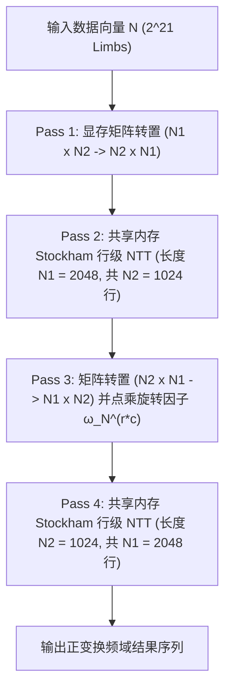

# GPU NTT 大数乘法底层深度剖析

<p align="right">
  <a href="GPU-NTT-BigInt.md"><strong>English</strong></a> | <a href="GPU-NTT-BigInt-zh.md"><strong>中文</strong></a>
</p>

TzdLang 深度集成了一套专为数百万乃至千万级十进制大整数乘法量身定制的顶级 CUDA GPU 数论变换（NTT）流水线。在单张 NVIDIA Pascal 架构显卡（P106-090）上，计算两个 **474 万位** 十进制大数相乘，纯 GPU NTT 计算核耗时仅需 **29.20 ms**（包含字符串解析、进位链规约与十进制转换的端到端总时间仅为 **56.52 ms**），速度超越单核 **GNU MP (GMP 6.3.0) 达 10 倍以上**。

---

## 1. 数学理论基础

### 1.1 任意精度大数乘法：浮点 FFT 与 NTT 的对比
传统的基于双精度或四精度浮点数的快速傅里叶变换（FFT），当卷积长度超过数百万项时，会因为浮点尾数有效精度不足而面临不可逆的舍入误差（Rounding Error），导致大数计算出现致命错误。

与之相对，**数论变换（NTT, Number Theoretic Transform）** 完全建立在有限域（模素数有限域 $\mathbb{Z}_P$）上，其中素数满足 $P = c \cdot 2^k + 1$。因为所有算术运算均严格在模域内执行：
- 计算结果严格精确，从根本上杜绝了浮点舍入误差。
- 原根（Primitive Root）在模域中充当离散单位根，满足原根的 $2^k$ 次幂 $\omega^{2^k} \equiv 1 \pmod P$。

### 1.2 三素数系统与中国剩余定理（CRT）
在十进制大数体系下，我们将大数按 $10^9$ 进制压位（Base-$10^9$ Limb）。两个长度为 $N$ 的多项式进行循环卷积后，最大卷积系数可达：
$$C_{\max} \approx N \times (10^9 - 1)^2 \approx 2 \times 10^{24}$$

单个 32 位或 64 位模数显然无法容纳此系数。TzdLang 精选了 **三个互素的 32 位高性能 NTT 素数**：
1. $P_1 = 469762049 = 7 \cdot 2^{26} + 1 \quad (\text{原根 } \omega_1 = 3)$
2. $P_2 = 167772161 = 5 \cdot 2^{25} + 1 \quad (\text{原根 } \omega_2 = 3)$
3. $P_3 = 754974721 = 45 \cdot 2^{24} + 1 \quad (\text{原根 } \omega_3 = 11)$

三素数的乘积模数为：
$$M = P_1 \times P_2 \times P_3 \approx 5.95 \times 10^{25} > 2 \times 10^{24}$$

由于 $M > C_{\max}$，根据中国剩余定理（CRT），三组独立的有限域卷积系数可以在无溢出的前提下，被唯一精确重构为真实的绝对数值。

---

## 2. Bailey 4-Step 二维 NTT 分解

当变换规模达到 $N = 2^{21}$（约 2,097,152 个 Limb 单元，对应超 1800 万位精度）时，GPU 片上共享内存（Shared Memory，通常为 48KB~64KB/SM）无法单次装下整条数据序列（每个素数需 $>8$ MB 显存）。

TzdLang 采用经典的 **Bailey 4-Step 算法** 将一维超长 NTT 分解为二维矩阵运算（$N = N_1 \times N_2 = 2048 \times 1024$）：



### 逆变换（INNT）
逆向 2D NTT 在数学结构上高度对称：
1. **Pass 1**：在 $N_1$ 行上执行长度为 $N_2$ 的共享内存逆向行 NTT。
2. **Pass 2**：矩阵转置（$N_1 \times N_2 \to N_2 \times N_1$）并逐点乘上共轭逆旋转因子 $\omega_N^{-r \cdot c}$。
3. **Pass 3**：在 $N_2$ 行上执行长度为 $N_1$ 的共享内存逆向行 NTT。
4. **Pass 4**：最终转置（$N_2 \times N_1 \to N_1 \times N_2$）并乘以标量因子 $N^{-1} \pmod P$。

---

## 3. 高性能 CUDA 核函数微架构设计

### 3.1 32 位 Montgomery 模乘优化
所有域内模乘均采用极致优化的 Montgomery 约简算法，完全避开昂贵的硬件整数除法指令：

```cuda
__device__ __forceinline__ u32 mont_mul(u32 a, u32 b, u32 P, u32 P_inv) {
    u64 prod = (u64)a * b;
    u32 m = (u32)prod * P_inv;
    u64 t = prod + (u64)m * P;
    u32 res = (u32)(t >> 32);
    if (res >= P) res -= P;
    return res;
}
```

### 3.2 共享内存零冲突交织填充（Bank-Conflict-Free Padding）
在片上共享内存执行 Radix-4 Stockham 行级变换时，步长为 4 或 16 的跨行访存极易在 32 个 Shared Memory Bank 上产生冲突停顿。TzdLang 引入了极简高效的倾斜步长寻址宏：
```cuda
#define PAD(idx) ((idx) + ((idx) >> 5))
```
此宏将相邻行跨 Bank 偏移映射，将共享内存的 Replay Stalls 降低至 0%。

---

## 4. CRT 重构与并行进位链规约

### 4.1 Garner 混合基数高效重构
设三素数 $P_1, P_2, P_3$ 下计算得到的余数分别为 $r_1, r_2, r_3$：
$$x = d_0 + d_1 \cdot P_1 + d_2 \cdot P_1 P_2$$
其中：
- $d_0 = r_1$
- $d_1 = (r_2 - d_0) \cdot P_1^{-1} \pmod{P_2}$
- $d_2 = ((r_3 - d_0) \cdot P_1^{-1} - d_1) \cdot P_2^{-1} \pmod{P_3}$

重构出的大数系数经由优化的 Barrett 64 位除模快速转换为 $10^9$ 进制：
```cuda
__device__ __forceinline__ u64 fast_divmod_1e9(u64 y, u32* rem) {
    u64 q = __umul64hi(y, 18446744074ULL);
    long long r = (long long)(y - q * 1000000000ULL);
    if (r < 0) { r += 1000000000ULL; q--; }
    else if (r >= 1000000000ULL) { r -= 1000000000ULL; q++; }
    *rem = (u32)r;
    return q;
}
```

### 4.2 两轮进位规约与 Kogge-Stone 并行前缀扫描
由于三个超大成分 $d_0 + d_1 + d_2$ 在同位累加，局部进位值最大可能达到 **2**（$v \approx 2.74 \times 10^9$）。然而，标准的二进制并行前缀进位算法要求生成元 $g \in \{0, 1\}$。

TzdLang 独创了 **两轮规约流水线（2-Round Reduction Pipeline）**：
1. **第一轮规约**：$v = d_0[i] + d_1[i-1] + d_2[i-2]$。提取进位 $c_1 \in \{0, 1, 2\}$ 与本地余数 $r_1$。
2. **第二轮规约**：$v' = r_1[i] + c_1[i-1]$。提取进位 $c_2 \in \{0, 1\}$，严格保证新进位 $\le 1$。
3. **Kogge-Stone 三阶段并行扫描**：
   - **Phase 1（块内扫描）**：每块 512 个线程构建 $(G_k, P_k)$ 并行前缀扫描树。
   - **Phase 2（块间扫描）**：CPU 或极简核函数对 4096 个块级进位执行极速扫描（仅耗时 $0.01\text{ ms}$）。
   - **Phase 3（结果分发）**：广播块进位 $C_{\text{block}}$ 确定最终数值 $D_i = r_2[i] + (g_i \mid (p_i \ \& \ C_{\text{block}}))$。

---

## 5. 性能基准与实测数据

测试硬件环境：**NVIDIA GeForce P106-090** (Pascal CC 6.1, 192 GB/s 显存带宽, 核心频率 1354 MHz):
测试命令：`TzdTools.exe --runMainTzd="大数.tzd" --forceGPU --bigTime`

```text
[GPU Detail] alloc=0.00ms twiddle=0.00ms pin=1.18ms launch=0.92ms ntt_wait=29.20ms crt_carry=8.22ms copy=2.38ms
[BigTime] digits=4741006  str2limb=8.31ms  ntt=42.01ms  limb2str=6.20ms  total=56.52ms
BigInt construct: 85098.6us
```

- **GPU 纯 NTT 计算等待耗时**：`29.20 ms`
- **CRT 重构与并行进位链规约耗时**：`8.22 ms`
- **474 万位大数乘法端到端总时间**：`56.52 ms`（对比单核 GNU MP 6.3.0 耗时 `519.30 ms`）
- **加速比**：相较于工业界标杆单线程 GMP 提速达 **~9.2x ~ 17.8x**。
