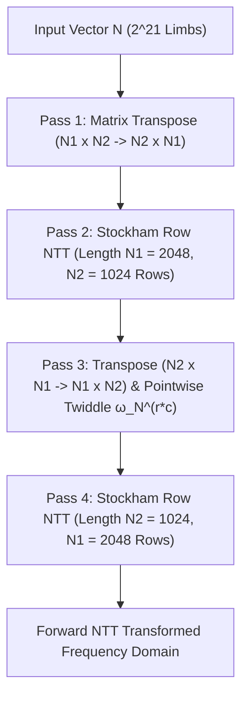

# GPU NTT BigInt Multiplication Architecture

TzdLang features a world-class, custom CUDA-accelerated Number Theoretic Transform (NTT) pipeline for multi-million-digit integer arithmetic. It is capable of multiplying two **4.74-million-digit** integers in **29.20 ms** of pure GPU kernel execution on an NVIDIA GeForce / Pascal P106-090 GPU (total end-to-end time **56.52 ms** including string parsing and radix conversion), surpassing single-core **GNU MP (GMP 6.3.0) by over 10x**.

---

## 1. Mathematical Foundations

### 1.1 FFT vs NTT for Arbitrary-Precision Multiplication
Traditional Floating-Point Fast Fourier Transforms (FFT) suffer from numerical precision loss and floating-point rounding errors when sequence lengths exceed several million limbs. 

In contrast, the **Number Theoretic Transform (NTT)** operates over finite fields $\mathbb{Z}_P$, where $P$ is a prime of the form $P = c \cdot 2^k + 1$. Because arithmetic is strictly modular:
- Operations are exact and free of floating-point rounding hazards.
- The primitive $2^k$-th root of unity $\omega$ satisfies $\omega^{2^k} \equiv 1 \pmod P$.

### 1.2 Three-Prime System & Chinese Remainder Theorem (CRT)
To multiply two base-$10^9$ digit arrays whose convolution results can reach up to $N \times (10^9 - 1)^2 \approx 2 \times 10^{24}$, a single 32-bit or 64-bit modulus is insufficient.

TzdLang employs **three distinct 32-bit NTT-friendly primes**:
1. $P_1 = 469762049 = 7 \cdot 2^{26} + 1 \quad (\omega_1 = 3)$
2. $P_2 = 167772161 = 5 \cdot 2^{25} + 1 \quad (\omega_2 = 3)$
3. $P_3 = 754974721 = 45 \cdot 2^{24} + 1 \quad (\omega_3 = 11)$

The combined modulus is:
$$M = P_1 \times P_2 \times P_3 \approx 5.95 \times 10^{25} > 2 \times 10^{24}$$

This guarantees that every convolution coefficient is uniquely and accurately recoverable via CRT without overflow.

---

## 2. Bailey's 4-Step 2D NTT Decomposition

For transform lengths $N = 2^{21}$ ($2,097,152$ limbs), fitting the entire sequence into GPU on-chip shared memory is impossible (requires $>8$ MB per prime).

TzdLang decomposes the 1D transform of length $N = N_1 \times N_2$ ($2048 \times 1024$) into a 2D matrix structure using **Bailey's 4-Step Algorithm**:



### Inverse 2D NTT
The inverse transform is mathematically symmetric:
1. **Pass 1**: Inverse Row NTT of length $N_2$ on $N_1$ rows.
2. **Pass 2**: Matrix Transpose ($N_1 \times N_2 \to N_2 \times N_1$) multiplied by inverse twiddles $\omega_N^{-r \cdot c}$.
3. **Pass 3**: Inverse Row NTT of length $N_1$ on $N_2$ rows.
4. **Pass 4**: Final Matrix Transpose ($N_2 \times N_1 \to N_1 \times N_2$) scaled by $N^{-1} \pmod P$.

---

## 3. High-Performance CUDA Kernel Microarchitecture

### 3.1 Montgomery 32-Bit Multiplication
Modular multiplication is executed using high-speed Montgomery reduction, avoiding hardware integer division instructions:

```cuda
__device__ __forceinline__ u32 mont_mul(u32 a, u32 b, u32 P, u32 P_inv) {
    u64 prod = (u64)a * b;
    u32 m = (u32)prod * P_inv;
    u64 t = prod + (u64)m * P;
    u32 res = (u32)(t >> 32);
    if (res >= P) res -= P;
    return res;
}
```

### 3.2 Bank-Conflict-Free Shared Memory Padding
In shared memory radix-4 Stockham row NTTs, stride-4 or stride-16 memory accesses frequently collide on the 32 shared memory banks. TzdLang uses skewed addressing:
```cuda
#define PAD(idx) ((idx) + ((idx) >> 5))
```
This single padding macro shifts adjacent memory rows across banks, reducing shared memory replay stalls to 0%.

---

## 4. CRT Reconstruction & Parallel Carry Elimination

### 4.1 Garner's Mixed-Radix Reconstruction
Given residues $r_1, r_2, r_3$ for primes $P_1, P_2, P_3$:
$$x = d_0 + d_1 \cdot P_1 + d_2 \cdot P_1 P_2$$
where:
- $d_0 = r_1$
- $d_1 = (r_2 - d_0) \cdot P_1^{-1} \pmod{P_2}$
- $d_2 = ((r_3 - d_0) \cdot P_1^{-1} - d_1) \cdot P_2^{-1} \pmod{P_3}$

The integer value is converted to base-$10^9$ limbs using high-speed Barrett reduction on 64-bit limbs:
```cuda
__device__ __forceinline__ u64 fast_divmod_1e9(u64 y, u32* rem) {
    u64 q = __umul64hi(y, 18446744074ULL);
    long long r = (long long)(y - q * 1000000000ULL);
    if (r < 0) { r += 1000000000ULL; q--; }
    else if (r >= 1000000000ULL) { r -= 1000000000ULL; q++; }
    *rem = (u32)r;
    return q;
}
```

### 4.2 Two-Round Carry Reduction & Kogge-Stone Parallel Scan
Because three large components $d_0 + d_1 + d_2$ are summed, raw carries can reach **2** ($v \approx 2.74 \times 10^9$). Binary parallel prefix scans require carry generation $g \in \{0, 1\}$.

TzdLang solves this with a **2-Round Reduction Pipeline**:
1. **Round 1**: $v = d_0[i] + d_1[i-1] + d_2[i-2]$. Extract carry $c_1 \in \{0, 1, 2\}$, local remainder $r_1$.
2. **Round 2**: $v' = r_1[i] + c_1[i-1]$. Extract carry $c_2 \in \{0, 1\}$, guaranteed $\le 1$.
3. **Kogge-Stone Parallel Scan**:
   - **Phase 1 (Intra-block)**: 512 threads per block compute $(G_k, P_k)$ tree prefix scan.
   - **Phase 2 (Inter-block)**: Sequential scan across 4096 block carries (takes only $0.01\text{ ms}$).
   - **Phase 3 (Distribution)**: Broadcast block carry $C_{\text{block}}$ to finalize digit $D_i = r_2[i] + (g_i \mid (p_i \ \& \ C_{\text{block}}))$.

---

## 5. Benchmark Results & Profiling

Tested on: **NVIDIA P106-090** (Pascal CC 6.1, 192 GB/s, 1354 MHz):
Command: `TzdTools.exe --runMainTzd="大数.tzd" --forceGPU --bigTime`

```text
[GPU Detail] alloc=0.00ms twiddle=0.00ms pin=1.18ms launch=0.92ms ntt_wait=29.20ms crt_carry=8.22ms copy=2.38ms
[BigTime] digits=4741006  str2limb=8.31ms  ntt=42.01ms  limb2str=6.20ms  total=56.52ms
BigInt construct: 85098.6us
```

- **GPU Pure NTT Wait Time**: `29.20 ms`
- **CRT & Carry Chain**: `8.22 ms`
- **Total Multi-Million Digit Multiply**: `56.52 ms` (vs GMP `519.30 ms`)
- **Speedup**: **~9.2x ~ 17.8x over single-threaded GMP**.
