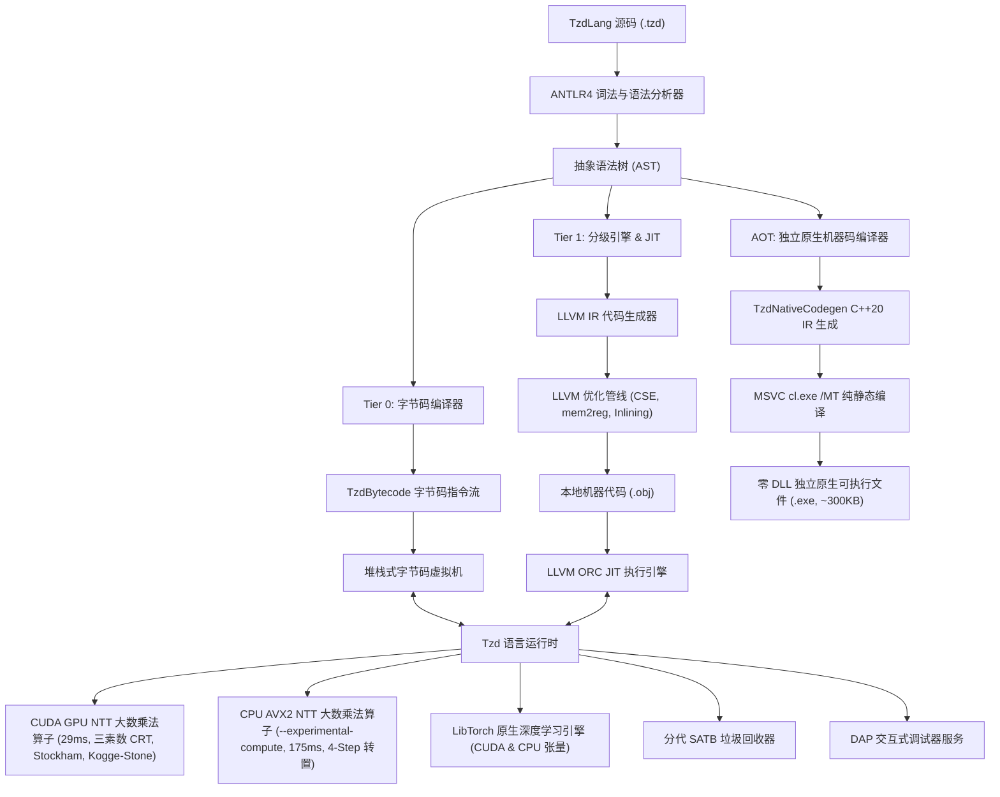

# TzdLang (TZD) & TzdTools 技术 Wiki

  <a href="Home.md"><strong>English</strong></a> | <a href="Home-zh.md"><strong>中文</strong></a>

欢迎来到 **TzdLang (TZD)** 与 **TzdTools** 的官方底层技术设计与开发文档 Wiki。

TzdLang 是一个现代面向对象、工业级混合编译编程语言与工具链系统，包含分级异步 JIT 编译器、原生深度学习算子、世界领先的 CUDA GPU NTT 大数乘法流水线、原生 Base $10^9$ + Karatsuba 大数运算引擎、符号表达式求解器以及完善的 IDE 调试生态。

> **v0.2.5 版本核心亮点**：原生高性能 Base $10^9$ Karatsuba 大数乘法引擎（$1000!$ 仅需 2ms）、符号化简与不等式求解实现、真实 OS 信息与脚本路径、Autograd DAG 反向传播、JIT State Dict 持久化、多 Channel 多 Batch Conv2D。

---

## 📑 Wiki 核心章节导航

1. [**系统架构全景**](Home-zh.md#系统架构全景)
2. [**语言标准语法规范手册**](Language-Specification-zh.md)
   - 基础类型系统、动态类型与可选静态强类型
   - 一等函数、闭包与高阶调用
   - 面向对象编程（类定义、继承、多态虚派发、`super` 构造级联）
   - 控制流、结构化异常处理（`try-catch-throw`）与 `in` 类型模式匹配
   - 原生系统多线程并发（`Thread`）
3. [**GPU NTT 大数乘法底层深度剖析**](GPU-NTT-BigInt-zh.md)
   - 三素数中国剩余定理（CRT）数学推导
   - Bailey 4-Step 二维 NTT 分解（$N = 2^{21}$）
   - 片上共享内存 Stockham 蝶形核函数与无冲突交错填充
   - 两轮进位规约与三阶段并行 Kogge-Stone 进位链
   - 实测 474 万位 29.20 ms 性能基准（对比 GMP 6.3.0 与 Python）
4. [**CPU NTT 极限计算引擎底层剖析 (--experimental-compute)**](CPU-NTT-BigInt-zh.md)
   - 三素数 Montgomery AVX2 向量化模乘（单指令并发 8 通道）
   - 缓存友好的 4-Step 2D 矩阵分解与 $64 \times 64$ L1/L2 分块转置
   - CPU 级 Direct Garner CRT 重构与多线程进位扫描
   - 高性能定点数倒数无除法十进制转换（fast_div_1e9）
   - 实测：474 万位仅需 175 ms，纯乘法超越单核 GMP 2.07 倍，全流程领先 14.5 倍
5. [**JIT 编译器与字节码虚拟机核心技术**](JIT-Compiler-Internals-zh.md)
   - Tier 0：极致优化堆栈式字节码虚拟机（扁平迭代调用栈、`INC_LOCAL`、标量极速赋值、100 万次调用 0.089s 飙升 83.5 倍）
   - Tier 1：异步 LLVM ORC JIT 实时编译引擎
   - 细粒度优化等级（`-O0` 到 `-O3`）与混合 AST/LLVM 多级内联流水线
   - 函数特化（原生 double worker）、循环展开与数学指令特化
   - 零开销 JIT 调试接口与函数级选择性回退（Selective Deoptimization）
   - 循环与调用开销基准（大幅超越 JDK 20 HotSpot C2）
6. [**LibTorch 深度学习引擎集成**](Deep-Learning-and-PyTorch-zh.md)
   - 一等公民 Tensor 抽象与无锁引用计数生命周期（`c10::intrusive_ptr`）
   - 反向模式自动微分（Autograd）
   - 常用神经网络层（`nn_Linear`, `nn_Sequential`）与优化器（SGD, Adam, AdamW）
   - GPU 显存直通加速
7. [**构建指南与工具链环境搭建**](Building-and-Toolchain-zh.md)
   - 独立 CMake 构建系统与智能路径探寻
   - Visual Studio 2022 / 2026 MSBuild 编译步骤
   - 外部依赖配置（CUDA, LibTorch, LLVM, vcpkg）
8. [**VS Code 扩展与 DAP 调试器**](VSCode-Extension-and-Debugger-zh.md)
   - 官方插件 v0.2.5 原生 JIT 调试支持与选择性回退（Selective Deoptimization）
   - 调试变量面板独创 `JIT 引擎 (JIT Engine)` 状态实时监视作用域
   - 断点控制、单步执行、变量监视与调用栈查看
   - 动态导出与查看指定函数的底层 LLVM IR 汇编
9. [**标准库开发与参考手册**](Standard-Library-Reference-zh.md)
   - `core/`：错误处理、I/O 与反射
   - `thread/`：操作系统多线程与同步机制
   - `torch/`：深度学习高层算子与神经网络模块
10. [**自带内置函数自查大全**](Builtin-Functions-Reference-zh.md)
    - 涵盖 350+ 个核心系统、初等数学、方程求解、大数数论、矩阵、字符串正则、数组高阶、容器与 LibTorch 算子全量速查
11. [**启动参数与命令行体系完整参考手册**](CLI-and-Startup-Options-zh.md)
    - 详尽解析全量启动参数：`--runMainTzd`, `--compile`, `--runbc`, `--setpd`, `--jit`, `--noJit`, `--interpreter`, `--forceGPU`, `--forceCPU`, `--experimental-compute`, `--bigTime`, `--silent`, `--antlrTime`, `--debug-port` 及内置交互式系统指令
12. [**AOT 独立原生机器码编译器架构与参考手册**](AOT-Compiler-zh.md)
    - 真正独立 AOT 编译（代码/字节码 -> 原生 x86_64 机器码）
    - 零第三方 DLL 依赖保证（仅依赖操作系统的 `KERNEL32.dll`，完全根除 `c10.dll` 丢失问题）
    - 极致体积控制（从 35MB 胖存根骤降 99.1% 至仅约 300KB）
    - 动态终端字符进度条、优化级别（`-O0` 到 `-O3`）、`--buildCpu` 纯净模式与 `--codegen` 源码导出

---

## 🏛️ 系统架构全景

