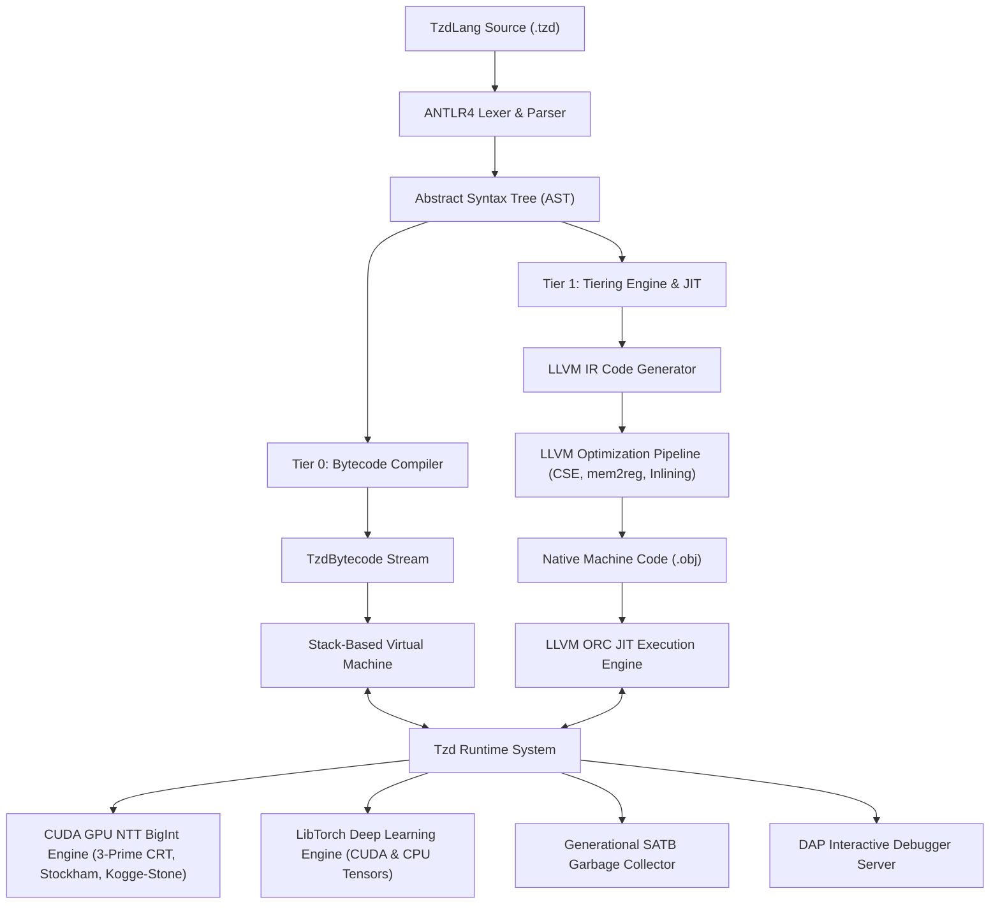

# TzdLang (TZD) & TzdTools Technical Wiki

Welcome to the official technical documentation and architecture wiki for **TzdLang (TZD)** and **TzdTools**.

TzdLang is an independently developed, high-performance object-oriented programming language featuring a hybrid tiered compilation model, native deep learning primitives, an ultra-fast GPU Number Theoretic Transform (NTT) BigInt multiplication engine, and complete tooling support.

---

## 📑 Wiki Contents

1. [**System Architecture Overview**](Home.md#system-architecture-overview)
2. [**Language Specification & Syntax Guide**](Language-Specification.md)
   - Types, dynamic and static annotations
   - Functions, closures, first-class values
   - Object-Oriented Programming (Classes, Inheritance, Virtual Dispatch, `super`)
   - Control flow, exception handling (`try-catch-throw`), type matching (`in`)
   - Native OS multithreading (`Thread`)
3. [**GPU NTT BigInt Multiplication Deep-Dive**](GPU-NTT-BigInt.md)
   - 3-Prime Chinese Remainder Theorem (CRT) algorithm
   - Bailey's 4-Step 2D NTT decomposition
   - Shared-memory Stockham kernels with bank-conflict-free padding
   - 2-Round carry reduction & parallel Kogge-Stone prefix scan
   - Performance benchmarks vs GNU MP (GMP) & Python
4. [**JIT Compiler Internals & Execution Tiers**](JIT-Compiler-Internals.md)
   - Tier 0: Compact Bytecode Virtual Machine
   - Tier 1: Asynchronous LLVM ORC JIT Engine
   - Native double worker specialization & Partial Evaluation
   - Optimization passes (mem2reg, CSE, DCE, inlining)
   - Benchmark comparisons against JDK 20 HotSpot
5. [**Deep Learning Engine (LibTorch Integration)**](Deep-Learning-and-PyTorch.md)
   - First-class Tensor types & zero-lock memory lifecycle
   - Automatic differentiation (Autograd)
   - Neural network layers & optimizers (SGD, Adam, AdamW)
   - GPU tensor offloading
6. [**Building & Toolchain Guide**](Building-and-Toolchain.md)
   - Standalone CMake build configuration
   - Visual Studio 2022 / 2026 MSBuild setup
   - Dependency management (CUDA, LibTorch, LLVM, vcpkg)
7. [**VS Code Extension & DAP Debugger**](VSCode-Extension-and-Debugger.md)
   - Debug Adapter Protocol (DAP) architecture
   - Setting breakpoints, stepping, variable inspection, stack traces
8. [**Standard Library Reference**](Standard-Library-Reference.md)
   - `core/`: Error handling, reflection, I/O
   - `thread/`: OS thread primitives, synchronization
   - `torch/`: Neural network layers and deep learning utilities

---

## 🏛️ System Architecture Overview

---

## 🎯 Quick Navigation

- **Writing your first script?** Check the [Language Specification](Language-Specification.md).
- **Curious about 29ms 4.74M-digit multiplication?** Read the [GPU NTT Deep-Dive](GPU-NTT-BigInt.md).
- **Wondering how JIT beats Java HotSpot?** See [JIT Compiler Internals](JIT-Compiler-Internals.md).
- **Building the project?** Head over to the [Building & Toolchain Guide](Building-and-Toolchain.md).
