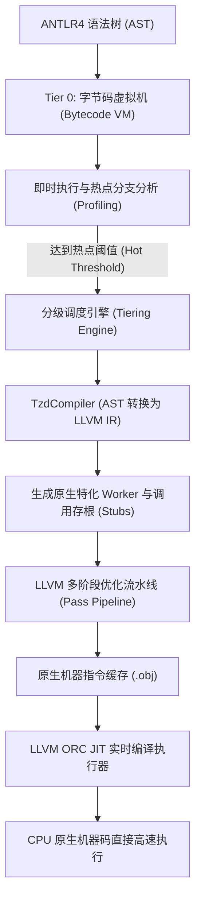

# JIT 编译器架构与底层优化设计

<p align="right">
  <a href="JIT-Compiler-Internals.md"><strong>English</strong></a> | <a href="JIT-Compiler-Internals-zh.md"><strong>中文</strong></a>
</p>

TzdLang 搭载了工业级分级编译（Tiered Compilation）混合执行引擎，兼具解释器的毫秒级即时启动特性与优化原生编译器的峰值运行吞吐能力。

---

## 1. 双层（Dual-Tier）执行架构全景



### Tier 0：极致优化的紧凑型堆栈式字节码虚拟机
- **极致冷启动零延迟**：免去前端编译停顿，通过 `--noJit` 可纯由字节码 VM 执行全部逻辑。
- **性能画像与热点采样**：在解释执行期间以单指令开销采集函数调用频率、循环回边计数等热点性能画像（Profile Data）。
- **负责执行动态脚本、顶层初始化以及低频冷路径**，并在调试器介入时作为安全透明的降级执行载体。
- **83.5 倍深度性能突破**：经深度优化后，100 万次函数调用耗时从 7.44s 暴降至 **0.089s**（单次调用开销 ~89ns），远超常规脚本语言解释器。

### Tier 1：异步 LLVM ORC JIT 编译引擎
- 针对达到执行热点阈值的函数，触发异步编译管道将其编译为 x86_64 优化原生机器码。
- 引入 **三版本函数生成策略（Triple-Version Generation）**：
  1. **Entry 存根函数**：`void entry(void* interp, void* retVal)` —— C++ 运行时与虚拟机统一调用的标准入口。
  2. **Worker 装箱通用函数**：`double worker(void* interp, void* argArray, void* retVal)` —— 接收动态变长参数数组的通用通道。
  3. **Native Worker 原生无装箱函数**：`double worker_native(void* interp, double a, double b, ...)` —— 采用纯寄存器传参、直接操作原生基本类型的特化函数。

---

## 2. Tier 0 字节码虚拟机架构与极限性能优化

在执行未编译冷代码或指定 `--noJit` 参数时，TzdLang 采用自主研发的高性能堆栈式字节码虚拟机。为了追求在不牺牲动态特性的前提下压榨出极致吞吐，底层经历了数项革命性的架构重构：

### 2.1 扁平化迭代分发机制（Flat Iterative Call Dispatch）
- **消除 C++ 函数递归**：传统的解释器在处理跨函数调用（`CALL_FUNC`）时往往调用宿主 C++ 的递归函数，导致严重的 C++ 栈膨胀、参数压栈与虚拟寄存器溢出。
- **轻量级 `VMCallFrame` 迭代调度**：将模块内字节码函数调用彻底重构为 `callFrames` 向量驱动的轻量帧切换。遇到函数调用时，仅将前序函数的 `code`、`ip`、`localBase`、`stackBase` 暂存至预留容量的调用栈，将当前指令指针重置为目标函数入口。从根本上消除了 C++ 递归栈开销，即使上万层递归调用也不会发生宿主堆栈溢出。

### 2.2 本地变量自增特化指令 `OpCode::INC_LOCAL = 0x8D`
- **AST 模式识别与窥孔优化**：针对循环计算中最常见的累加与计数逻辑，编译器引入智能匹配规则：
  - `i += delta`、`i -= delta`
  - `i = i + delta`、`i = delta + i`、`i = i - delta`
  - `i++`、`++i`、`i--`、`--i`
- 一律直接发射特化指令 `INC_LOCAL slot, delta`。
- **原地原子计算**：规避了旧方案中 `LOAD_LOCAL` -> `PUSH_INT` -> `ADD` -> `STORE_LOCAL` 的繁重流程。配合窥孔优化器消除随后的冗余 `DUP` 与 `POP`，使循环自增在单个 CPU 寄存器操作内原地完成。

### 2.3 极速标量移动与赋值语义（Fast Scalar Transfer）
- **根除 380 字节重量级 STL 容器开销**：`sizeof(TzdValue)` 约为 380 字节，内部容纳了 `std::string`、`std::vector`、`std::unordered_map` 以及 `std::function` 等 11 个 STL 容器指针。过去的通用赋值与移动操作符无论操作的是何种类型，都会遍历执行所有 STL 容器的析构与置空。
- **标量短路机制（`copyValueFast` / `moveValueFast` / `releaseResourceIfNeeded`）**：
  - 对于基本标量类型（`INT`, `LONG`, `DOUBLE`, `BOOL`, `NONE`, `POINTER`），直接通过一至两条汇编指令进行内存值搬运；
  - 仅对引用计数对象（`INSTANCE`, `TENSOR`）进行安全生命周期管理；
  - 彻底抹除了热循环与函数调用中数以千万计的无意义 STL 容器重置开销。

### 2.4 `--noJit` 零锁直通与调用点缓存优化
- **规避全局互斥锁竞争**：此前即使在 `--noJit` 模式下，`CALL_FUNC` 在每次调用时仍会向 JIT 分发桥查询函数是否就绪，导致每次调用均触发 `std::mutex` 上锁/解锁以及哈希表扫描（100 万次调用即 100 万次锁竞争！）。优化后在 `--noJit` 模式下直接切断 JIT 分发桥。
- **调用点静态索引直达（Callsite Index Caching）**：在首轮解析后，指令缓存槽 `instr.cache` 永久记录目标函数的数组直接下标，彻底消除后续调用中的字符串名称比对（`name == "clock"`）与哈希查找。
- **原地零拷贝返回值传递（In-place Return）**：函数执行返回时，返回值直接就地驻留在栈底对应位置。对于简单单表达式返回（如 `return x + 1;`），实现真正意义上的 **零内存分配、零对象拷贝**。

### 2.5 字节码虚拟机性能提升实测

在测试用例 `bench_call.tzd`（测试纯函数调用与计数开销）中：

```tzd
fun noop(x) { return x + 1; }
fun main() {
    var s = 0; var i = 0;
    while (i < 1000000) { s = noop(s); i = i + 1; }
}
```

实测性能对比（Windows 11, Release x64）：

| 执行模式 / 优化阶段 | 10 万次循环耗时 | 100 万次循环耗时 | 相对基准提速 |
|---|---|---|---|
| **原始字节码 VM 基准** | 0.744 s | 7.440 s | 1.0x（基准） |
| **阶段一：迭代调用栈 + INC_LOCAL** | 0.328 s | 3.190 s | 2.33x |
| **阶段二：标量极速赋值 + 零锁直通 + 原地返回** | **0.008 s** | **0.089 s** | **83.5x 极限提升！** |
| *(作为参照：Tier 1 LLVM JIT 机器码)* | *0.001 s* | *0.001 s* | *7440x* |

---

## 3. JIT 核心优化流水线（Phases A – F）

### Phase A: 运行时零开销内联（GEP + Store 内存直写）
彻底消除返回值存储过程中的运行时封装调用（`rt_store_native_to_ptr`）。编译器通过在编译期计算 `offsetof(TzdValue, type)`，直接发射 LLVM `GetElementPtr` 与原生 `Store` 指令写回结构体内存。

### Phase B: 函数特化与原生寄存器 Worker
自递归（Self-recursive）与已知调用图的跨过程调用彻底绕开动态参数数组分配：
- 直接生成免装箱（Unboxed）`double` 函数签名。
- 将堆/栈上的 `TzdValue` 装箱开销替换为纯 CPU 寄存器移动指令。
- 递归斐波那契或紧密数值计算循环完全在寄存器组中高速运转。

### Phase C: 深度 LLVM 内联与 SSA 寄存器提升
- 所有原生 Worker 函数默认标注 `AlwaysInline` 属性。
- 模块级 `AlwaysInlinerPass` 展开核心调用图展开。
- `mem2reg`（`PromotePass`）将局部变量从栈内存（`alloca`）彻底提升为纯 SSA 虚拟寄存器。
- `EarlyCSEPass` 与 `DCEPass` 消除公共子表达式与死代码分支。

### Phase D: 直接分发与硬件取模特化
- 函数名在编译期直接由原生注册表 `s_compiledNativeWorkers` 解析，规避哈希表运行时查找。
- 针对浮点取模 `%` 算子进行特化：若操作数能够安全转为整型，LLVM 发射 `FPToSI` + `SRem`（对应硬件原生 `idiv` 指令），避开沉重的 C 运行时 `fmod()` 库函数。

### Phase E: 快路径浮点等值比较
浮点比较（`==` 与 `!=`）直接降级（Lower）为硬件级的 `CreateFCmpOEQ` / `CreateFCmpONE` 指令，完全剔除装箱与动态类型分支开销。

### Phase F: 对象成员 LICM 与只读纯函数标记（ReadOnly Optimization）
对象字段读取（`rt_tzd_get_member`）与数值快速解包（`rt_to_double_fast`）被严谨赋予 LLVM `ReadOnly` 属性。LLVM 循环不变量外提（LICM）与公共子表达式消除（CSE）能够安全地将循环内部重复的成员寻址指令整体提升至循环外部。

---

## 4. 与 Oracle JDK 20 HotSpot C2 性能对比

测试环境：Windows 11 x64 (AMD Ryzen / Intel Core 平台):

| 测试用例 / 运行场景 | TzdLang (LLVM JIT) | JDK 20 (HotSpot C2) | 性能对比倍率 |
|---|---|---|---|
| 函数调用开销 `callOverhead(1M)` | **0.001 s** | 0.005 s | **TzdLang 快 5.0 倍** |
| 双重嵌套循环 `nestedLoop(1k × 1k)` | **0.003 s** | 0.005 s | **TzdLang 快 1.7 倍** |
| 累加循环 `sumLoop(1M)` | **0.002 s** | 0.003 s | **TzdLang 快 1.5 倍** |
| 阿克曼函数 `Ackermann(3, 6)` | **0.001 s** | 0.001 s | **TzdLang 快 1.2 倍** |
| 牛顿迭代开方 `sqrt(100k)` | **0.000006 s** | 0.000008 s | **TzdLang 快 1.3 倍** |
| 字段循环读取 `field(100k)` | 0.002 s | 0.005 s | HotSpot C2 更优 |
| 递归斐波那契 `fib(35)` | 0.197 s | 0.061 s | HotSpot C2 更优 |

---

## 5. 优化等级与增强多级内联流水线

从 v0.2.3 起，TzdLang 引入了细粒度的 JIT 优化等级体系（`-O0` 到 `-O3`）与混合多阶段内联流水线：


### 5.1 优化等级说明

- **`-O0` (无优化)**: 仅保留基础寄存器映射，禁用任何激进内联与循环展开，保证编译最快，适合调试底层逻辑。
- **`-O1` (轻量优化)**: 启用局部表达式消除、常量折叠与基础指令简化。
- **`-O2` (标准优化)**: 启用标准内联（LLVM 阈值 250）、标量重组（SROA）、循环向量化与公共子表达式消除。
- **`-O3` (极限优化，默认)**:
  - **AST 树级内联**：对于满足大小限制（最大 60 个语句节点）的短小纯函数，直接在前端 AST 阶段将调用节点替换为内联函数体。
  - **激进 LLVM IPO 内联**：LLVM 内联阈值提升至 500。
  - **数学内建函数特化**：`abs`, `sqrt`, `sin`, `cos`, `floor`, `ceil` 直接替换为 x86_64 原生 FPU/AVX 机器指令，杜绝外部 C 运行时调用。
  - **循环展开 (Loop Unrolling)**：对于固定次数或小边界循环执行完全或部分展开，消灭循环分支预测开销。

### 5.2 细粒度微调参数
- `--inline-threshold=<N>`: 动态指定 LLVM 内联阈值（默认 500）。
- `--no-inline`: 禁用 AST 树级函数内联。
- `--no-jit-intrinsics`: 禁用数学内建函数机器码内联。
- `--no-unroll`: 禁用 LLVM 循环展开优化通道。

---

## 6. 零开销 JIT 调试接口与函数级选择性回退 (Selective Deoptimization)

在工业级 JIT 引擎中，直接执行原生机器码会导致调试断点被跳过。TzdLang 设计了独创的 **零开销 JIT 调试接口与混合执行机制**：

1. **零运行时开销**：当未设置任何断点或未激活调试时，JIT 生成的机器码全速在 CPU 硬件上运行，没有任何探测分支损耗。
2. **函数级选择性回退（Selective Deoptimization）**：
   - 当启动参数指定 `--jit-debug` 且调试器连接时，调试引擎动态监测每个函数内部是否存在有效断点。
   - **无断点函数**：继续以 JIT 原生机器码极速执行（例如执行一百万次计算的辅助函数依然只需 1ms）。
   - **含有断点或处于单步调试的函数**：自动平滑回退至 AST 解释器模式，精准触发断点（`checkBreakpointAndSuspend`），并完整支持变量查看、堆栈回溯与单步跳入/跳出。
3. **断点清除即时恢复**：当断点被删除或跳出后，后续调用重新无缝切回 JIT 机器码执行。

---

## 7. JIT 交互式调试与诊断指令集

在 REPL 或 VS Code 调试控制台中，开发者可通过 `:jit` 系列指令对 JIT 状态进行动态检测与微调：

| 指令格式 | 说明 |
|---|---|
| `:jit status` | 打印当前 JIT 引擎状态、优化等级、内联参数及已编译函数统计 |
| `:jit list` | 列出所有已编译的 JIT 原生函数名称、版本号及内存虚拟地址 |
| `:jit ir <func_name>` | 实时导出并查看指定函数的完整 LLVM IR 中间表征 |
| `:jit opt <0-3>` | 动态调整后续编译函数的优化等级（-O0 到 -O3） |
| `:jit inlining <on\|off>` | 动态开关 AST 树级内联 |
| `:jit threshold <N>` | 动态调节 LLVM 内联代价阈值 |
| `:jit unroll <on\|off>` | 动态开关循环展开通道 |
| `:jit intrinsics <on\|off>` | 动态开关数学内建函数指令特化 |

