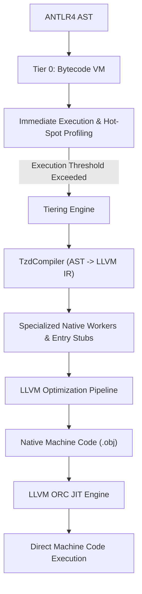
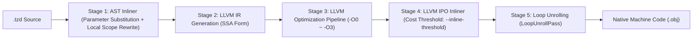

# JIT Compiler Architecture & Optimization Internals

<p align="right">
  <a href="JIT-Compiler-Internals.md"><strong>English</strong></a> | <a href="JIT-Compiler-Internals-zh.md"><strong>中文</strong></a>
</p>

TzdLang features a cutting-edge hybrid tiered compilation engine designed to combine the sub-millisecond startup of an interpreter with the maximum throughput of an optimizing native compiler.

---

## 1. Dual-Tier Execution Architecture



#### Tier 0: Ultra-Optimized Compact Bytecode Virtual Machine
- **Zero-Latency Cold Startup**: Executes code immediately without compilation pauses. Can run exclusively via `--noJit`.
- **Low-Overhead Profiling**: Gathers execution metrics and call-frequency statistics with single-instruction overhead.
- **Dynamic Script & Safe Fallback Carrier**: Executes dynamic scripts, initialization routines, and serves as a completely transparent deoptimization target during interactive debugging.
- **83.5x Throughput Breakthrough**: Deep optimization reduced 1,000,000 function call overhead from 7.44s to **0.089s** (~89ns per call iteration).

### Tier 1: Asynchronous LLVM ORC JIT
- Compiles hot functions into optimized x86_64 native code.
- Employs **Triple-Version Function Generation**:
  1. **Entry Function**: `void entry(void* interp, void* retVal)` — Entry interface callable from the C++ VM.
  2. **Worker Function**: `double worker(void* interp, void* argArray, void* retVal)` — General execution path with boxed arguments.
  3. **Native Worker**: `double worker_native(void* interp, double a, double b, ...)` — Direct register-passed unboxed primitives.

---

## 2. Tier 0 Bytecode VM Architecture & Ultra Optimization

When running uncompiled code or when the `--noJit` flag is specified, TzdLang executes via an in-house developed, high-performance stack-based bytecode virtual machine. Recent architectural refactors delivered transformative execution throughput:

### 2.1 Flat Iterative Call Dispatch
- **Elimination of C++ Recursion**: Traditional script interpreters invoke recursive host C++ functions for `CALL_FUNC`, causing heavy host stack frame allocations, parameter pushes, and cache thrashing.
- **Lightweight `VMCallFrame` Iterative Switching**: Calls between intra-module bytecode functions are now driven iteratively via a pre-allocated `callFrames` stack. The caller's `code`, `ip`, `localBase`, and `stackBase` are saved to the frame vector and execution jumps directly to the callee's instruction sequence. This completely removes C++ stack overhead and allows arbitrarily deep recursive script calls without stack overflow.

### 2.2 Local In-Place Counter OpCode `INC_LOCAL = 0x8D`
- **Compiler Pattern Matching & Peephole Optimization**: For hot numerical loops, the compiler directly detects counter patterns:
  - `i += delta`, `i -= delta`
  - `i = i + delta`, `i = delta + i`, `i = i - delta`
  - `i++`, `++i`, `i--`, `--i`
- Emits specialized `INC_LOCAL slot, delta` instructions.
- **In-Place Atomic Updates**: Bypasses the traditional `LOAD_LOCAL` -> `PUSH_INT` -> `ADD` -> `STORE_LOCAL` sequence. The peephole optimizer removes subsequent `DUP` and `POP` operations, executing loop counter updates in a single register-level operation.

### 2.3 Fast Scalar Transfer Semantics
- **Elimination of 380-Byte Heavy STL Container Overhead**: `sizeof(TzdValue)` is approximately 380 bytes, containing 11 STL containers (`std::string`, `std::vector`, `std::unordered_map`, `std::function`). Standard value moves/copies traversed and cleared all containers even for simple integers.
- **Scalar Fast-Paths (`copyValueFast` / `moveValueFast` / `releaseResourceIfNeeded`)**:
  - Primitive types (`INT`, `LONG`, `DOUBLE`, `BOOL`, `NONE`, `POINTER`) copy and move directly in 1-2 scalar assembly instructions.
  - Ref-counted objects (`INSTANCE`, `TENSOR`) are handled with minimal atomic ref-count adjustments.
  - Millions of redundant STL container re-allocations are entirely eliminated from hot execution paths.

### 2.4 `--noJit` Zero-Lock Direct Dispatch & Callsite Caching
- **Bypassing Global Mutex Contention**: In prior builds, every `CALL_FUNC` queried the JIT tiering dispatcher under a `std::mutex` lock and queried hash tables (1M calls = 1M mutex acquisitions). Under `--noJit`, the JIT bridge is now completely bypassed with zero lock contention.
- **Callsite Index Caching**: The instruction's `cache` slot permanently stores the target function index on first execution, avoiding string comparisons and hash lookups on all subsequent calls.
- **In-Place Return Value Placement**: Callee return values are placed directly at the caller's stack top. For single-expression returns (`return x + 1;`), this achieves zero temporary heap allocation and zero value copies.

### 2.5 Bytecode VM Performance Benchmark

Benchmark scenario: `test/bench_call.tzd` (1,000,000 function call overhead):

```tzd
fun noop(x) { return x + 1; }
fun main() {
    var s = 0; var i = 0;
    while (i < 1000000) { s = noop(s); i = i + 1; }
}
```

Results on Windows 11 x64 (Release Build):

| Execution Mode / Optimization Stage | 100k Calls | 1M Calls | Speedup vs Baseline |
|---|---|---|---|
| **Original Bytecode VM Baseline** | 0.744 s | 7.440 s | 1.0x (Baseline) |
| **Stage 1: Iterative Call Stack + INC_LOCAL** | 0.328 s | 3.190 s | 2.33x |
| **Stage 2: Fast Scalar Transfer + Zero-Lock + In-Place Return** | **0.008 s** | **0.089 s** | **83.5x Speedup!** |
| *(For comparison: Tier 1 LLVM JIT)* | *0.001 s* | *0.001 s* | *7440x* |

---

## 3. JIT Optimization Pipeline (Phases A – F)

### Phase A: Runtime Inlining via GEP + Store
Eliminates intermediate runtime calls (`rt_store_native_to_ptr`) when storing return values. The compiler computes the memory offset using `offsetof(TzdValue, type)` and writes directly via LLVM `GetElementPtr` (GEP) and `Store` instructions.

### Phase B: Function Specialization & Native Workers
Self-recursive and inter-procedural function calls avoid dynamic argument arrays:
- Directly generates unboxed `double` signatures.
- Replaces boxed `TzdValue` allocations with CPU register moves.
- Recursion in Fibonacci or mathematical loops executes entirely in registers.

### Phase C: Aggressive LLVM Inlining & SSA Promotion
- Native workers are tagged with the `AlwaysInline` attribute.
- Module-level `AlwaysInlinerPass` inlines critical call graphs.
- `mem2reg` (`PromotePass`) elevates local variables from stack `alloca` memory locations into pure SSA virtual registers.
- `EarlyCSEPass` and `DCEPass` eliminate redundant computations and dead branches.

### Phase D: Direct Dispatch & Hardware Modulo Specialization
- Function names are looked up in a compile-time worker registry (`s_compiledNativeWorkers`), bypassing hash table lookups.
- Floating-point modulo `%` operations are specialized: if operands are integer-convertible, LLVM generates `FPToSI` + `SRem` (emitting hardware `idiv`), avoiding heavy runtime `fmod()` calls.

### Phase E: Fast-Path Floating Point Comparison
Floating-point comparisons (`==` and `!=`) lower directly into hardware `CreateFCmpOEQ` / `CreateFCmpONE` instructions, removing dynamic boxing.

### Phase F: Object LICM & ReadOnly Optimization
Object field lookups (`rt_tzd_get_member`) and numeric unboxing (`rt_to_double_fast`) are marked with the LLVM `ReadOnly` attribute. LLVM's Loop Invariant Code Motion (LICM) safely hoists repetitive field lookups out of loops.

---

## 4. Performance Comparison with Oracle JDK 20 HotSpot C2

Test environment: Windows 11 x64:

| Benchmark / Workload | TzdLang (LLVM JIT) | JDK 20 (HotSpot C2) | Comparison |
|---|---|---|---|
| Function Call Overhead `callOverhead(1M)` | **0.001 s** | 0.005 s | **TzdLang is 5.0x faster** |
| Nested Loop `nestedLoop(1k × 1k)` | **0.003 s** | 0.005 s | **TzdLang is 1.7x faster** |
| Accumulator Loop `sumLoop(1M)` | **0.002 s** | 0.003 s | **TzdLang is 1.5x faster** |
| Ackermann Function `Ackermann(3, 6)` | **0.001 s** | 0.001 s | **TzdLang is 1.2x faster** |
| Newton-Raphson Sqrt `sqrt(100k)` | **0.000006 s** | 0.000008 s | **TzdLang is 1.3x faster** |
| Object Field Access `field(100k)` | 0.002 s | 0.005 s | HotSpot C2 is faster |
| Recursive Fibonacci `fib(35)` | 0.197 s | 0.061 s | HotSpot C2 is faster |

---

## 5. Optimization Levels & Multi-Stage Inlining Pipeline

Starting from v0.2.3, TzdLang supports granular JIT optimization levels (`-O0` to `-O3`) and a multi-stage inlining pipeline:



### 5.1 Optimization Level Guide

- **`-O0` (No Optimization)**: Basic register mapping only, aggressive inlining and loop unrolling disabled. Fastest compilation, ideal for low-level debugging.
- **`-O1` (Light Optimization)**: Local subexpression elimination, constant folding, and instruction simplification.
- **`-O2` (Standard Optimization)**: Standard inlining (threshold 250), scalar replacement of aggregates (SROA), and common subexpression elimination.
- **`-O3` (Aggressive Optimization, Default)**:
  - **AST-Level Inlining**: Functions with <= 60 AST statements are inlined directly at the front-end AST level.
  - **Aggressive LLVM IPO Inlining**: Inter-procedural inlining threshold boosted to 500.
  - **Mathematical Intrinsics**: `abs`, `sqrt`, `sin`, `cos`, `floor`, `ceil` lower directly to x86_64 FPU/AVX instructions.
  - **Loop Unrolling**: Constant or bounded loops are unrolled to eliminate branch prediction overhead.

### 5.2 Fine-Tuning CLI Flags
- `--inline-threshold=<N>`: Customize LLVM inlining threshold (default 500).
- `--no-inline`: Disable AST-level function inlining.
- `--no-jit-intrinsics`: Disable native mathematical intrinsics.
- `--no-unroll`: Disable LLVM loop unrolling.

---

## 6. Zero-Overhead JIT Debug Interface & Selective Deoptimization

In a production JIT engine, running direct machine code bypasses software breakpoints. TzdLang implements a **Zero-Overhead JIT Debug Interface & Selective Deoptimization Mechanism**:

1. **Zero Runtime Overhead**: When no breakpoints are active, JIT code runs at full native CPU speed without probe penalties.
2. **Selective Deoptimization**:
   - When `--jit-debug` is passed and a DAP debugger connects, the engine tracks active breakpoints across all functions.
   - **Functions without breakpoints**: Continue running as native JIT machine code at full speed (e.g. 1M calculations finish in ~1ms).
   - **Functions containing breakpoints or during step operations**: Smoothly deoptimize to the interpreter, reliably hitting breakpoints (`checkBreakpointAndSuspend`) with full variable inspection, stack backtraces, and step-in/step-out capability.
3. **Instant Resumption**: Deleting breakpoints restores JIT native machine code execution immediately.

---

## 7. Interactive JIT Debugging & Diagnostic Commands

Within the REPL or VS Code Debug Console, developers can inspect and adjust JIT behavior using the `:jit` command set:

| Command | Description |
|---|---|
| `:jit status` | Display JIT engine state, optimization level, inlining settings, and compiled function count |
| `:jit list` | List all compiled JIT functions, versions, and memory virtual addresses |
| `:jit ir <func_name>` | Export and view complete LLVM IR for the specified function |
| `:jit opt <0-3>` | Dynamically adjust optimization level for subsequently compiled functions |
| `:jit inlining <on\|off>` | Toggle AST-level function inlining |
| `:jit threshold <N>` | Adjust LLVM inlining cost threshold |
| `:jit unroll <on\|off>` | Toggle loop unrolling passes |
| `:jit intrinsics <on\|off>` | Toggle math function instruction specialization |
