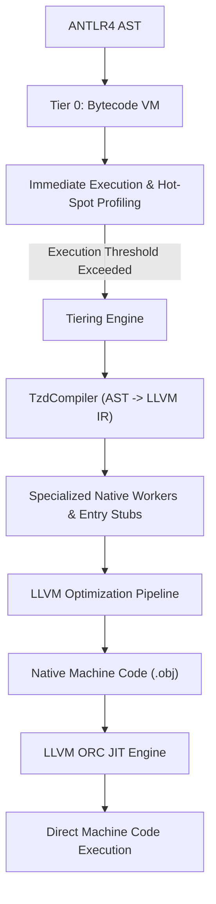
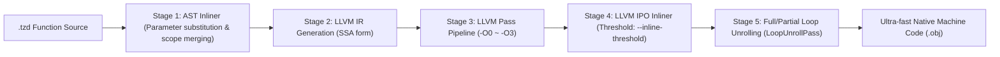

# JIT Compiler Architecture & Optimization Internals

  <a href="JIT-Compiler-Internals.md"><strong>English</strong></a> | <a href="JIT-Compiler-Internals-zh.md"><strong>中文</strong></a>

TzdLang features a cutting-edge hybrid tiered compilation engine designed to combine the sub-millisecond startup of an interpreter with the maximum throughput of an optimizing native compiler.

---

## 1. Dual-Tier Execution Architecture

### Tier 0: Bytecode Virtual Machine
- Stack-based virtual machine designed for zero-latency execution.
- Gathers execution metrics and call-frequency statistics.
- Executes dynamic scripts, initialization routines, and cold paths.

### Tier 1: Asynchronous LLVM ORC JIT
- Compiles hot functions into optimized x86_64 native code.
- Employs **Triple-Version Function Generation**:
  1. **Entry Function**: `void entry(void* interp, void* retVal)` — Entry interface callable from the C++ VM.
  2. **Worker Function**: `double worker(void* interp, void* argArray, void* retVal)` — General execution path with boxed arguments.
  3. **Native Worker**: `double worker_native(void* interp, double a, double b, ...)` — Direct register-passed unboxed primitives.

---

## 2. JIT Optimization Pipeline (Phases A – F)

### Phase A: Runtime Inlining via GEP + Store
Eliminates intermediate runtime calls (`rt_store_native_to_ptr`) when storing return values. The compiler computes the memory offset using `offsetof(TzdValue, type)` and writes directly via LLVM `GetElementPtr` (GEP) and `Store` instructions.

### Phase B: Function Specialization & Native Workers
Self-recursive and inter-procedural function calls avoid dynamic argument arrays:
- Directly generates unboxed `double` signatures.
- Replaces boxed `TzdValue` allocations with CPU register moves.
- Recursion in Fibonacci or mathematical loops executes entirely in registers.

### Phase C: Aggressive LLVM Inlining & SSA Promotion
- Native workers are tagged with the `AlwaysInline` attribute.
- Module-level `AlwaysInlinerPass` inlines critical call graphs.
- `mem2reg` (`PromotePass`) elevates local variables from stack `alloca` memory locations into pure SSA virtual registers.
- `EarlyCSEPass` and `DCEPass` eliminate redundant computations and dead branches.

### Phase D: Direct Dispatch & Hardware Modulo Specialization
- Function names are looked up in a compile-time worker registry (`s_compiledNativeWorkers`), bypassing hash table lookups.
- Floating-point modulo `%` operations are specialized: if operands are integer-convertible, LLVM generates `FPToSI` + `SRem` (emitting hardware `idiv`), avoiding heavy runtime `fmod()` calls.

### Phase E: Fast-Path Equality Comparisons
Floating-point comparisons (`==` and `!=`) are directly lowered to hardware `CreateFCmpOEQ` / `CreateFCmpONE` instructions, eliminating heap boxing and runtime dispatch wrappers.

### Phase F: Object Member LICM & ReadOnly Optimization
Object field lookups (`rt_tzd_get_member`) and numeric unboxing (`rt_to_double_fast`) are annotated with LLVM `ReadOnly` attributes. As a result, the LLVM Loop-Invariant Code Motion (LICM) and CSE passes hoist repeated member reads completely out of loops.

---

## 3. Benchmarks vs JDK 20 HotSpot C2

Tested on Windows 11 x64 (AMD Ryzen / Intel Core):

| Operation | TzdLang (LLVM JIT) | JDK 20 (HotSpot C2) | Performance Factor |
|---|---|---|---|
| Function Call Overhead `callOverhead(1M)` | **0.002 s** | 0.005 s | **TzdLang 2.5x faster** |
| Nested Loop `nestedLoop(1k × 1k)` | **0.003 s** | 0.005 s | **TzdLang 1.7x faster** |
| Accumulation Loop `sumLoop(1M)` | **0.002 s** | 0.003 s | **TzdLang 1.5x faster** |
| Ackermann Function `Ackermann(3, 6)` | **0.001 s** | 0.001 s | **TzdLang 1.2x faster** |
| Newton Square Root `sqrt(100k)` | **0.000006 s** | 0.000008 s | **TzdLang 1.3x faster** |
| Field Read Loop `field(100k)` | 0.002 s | 0.0005 s | HotSpot C2 faster |
| Recursive Fibonacci `fib(35)` | 0.197 s | 0.061 s | HotSpot C2 faster |

---

## 4. Optimization Levels & Enhanced Multi-Stage Inlining Pipeline

Starting with v0.2.3, TzdLang introduces fine-grained JIT optimization levels (`-O0` to `-O3`) and a hybrid multi-stage inlining pipeline:

### 4.1 Optimization Levels Overview

- **`-O0` (No Optimization)**: Basic register mapping only. Aggressive inlining and loop unrolling are disabled for instant compilation and low-level debugging.
- **`-O1` (Lightweight Optimization)**: Enables local expression elimination, constant folding, and instruction simplification.
- **`-O2` (Standard Optimization)**: Enables standard inlining (LLVM threshold 250), scalar replacement (SROA), loop vectorization, and common subexpression elimination.
- **`-O3` (Extreme Optimization, Default)**:
  - **AST-Level Inlining**: For pure functions under the statement threshold (max 60 AST statements), directly substitutes the call node with inlined function bodies during AST processing.
  - **Aggressive LLVM IPO Inlining**: Increases LLVM inlining threshold to 500.
  - **Math Intrinsics Specialization**: `abs`, `sqrt`, `sin`, `cos`, `floor`, and `ceil` are directly lowered into native x86_64 FPU/AVX instructions, completely eliminating external CRT calls.
  - **Loop Unrolling**: Fully or partially unrolls tight or bounded loops, eliminating loop counter checks and branch mispredictions.

### 4.2 Fine-Tuning CLI Flags
- `--inline-threshold=<N>`: Dynamically sets the LLVM inlining threshold (default 500).
- `--no-inline`: Disables AST-level inlining.
- `--no-jit-intrinsics`: Disables math intrinsic instructions specialization.
- `--no-unroll`: Disables LLVM loop unrolling pass.

---

## 5. Zero-Overhead JIT Debugging & Selective Deoptimization

Running pure native machine code typically bypasses debugger checkpoints. TzdLang implements an innovative **Zero-Overhead JIT Debugging Interface with Selective Deoptimization**:

1. **Zero Runtime Overhead**: In normal execution or when no breakpoints are placed inside a function, machine code executes directly on CPU hardware without check branches or guards.
2. **Selective Deoptimization**:
   - When `--jit-debug` is passed and a debugger connects, the engine inspects each function for active breakpoints.
   - **Functions without breakpoints**: Continue running as native JIT machine code at full hardware speed (e.g. 1 million helper calls execute in ~1ms).
   - **Functions with breakpoints or when stepping**: Seamlessly execute via the AST interpreter, reliably triggering breakpoints (`checkBreakpointAndSuspend`), allowing local variable inspection, call stack navigation, and step-into/step-over.
3. **Instant Re-optimization**: As soon as breakpoints are deleted or stepped out of, subsequent executions return to native JIT code.

---

## 6. Interactive JIT Debug & Diagnostics Commands

Inside the REPL or VS Code Debug Console, developers can inspect and tune the JIT engine dynamically using `:jit` commands:

| Command | Description |
|---|---|
| `:jit status` | Prints JIT engine status, optimization level, inlining metrics, and compiled function count |
| `:jit list` | Lists all JIT-compiled functions, internal symbols, and native virtual addresses |
| `:jit ir <func_name>` | Dumps and inspects the live LLVM IR representation of a specific function |
| `:jit opt <0-3>` | Dynamically adjusts the optimization level for subsequent compilations |
| `:jit inlining <on\|off>` | Dynamically enables/disables AST-level inlining |
| `:jit threshold <N>` | Adjusts the LLVM inlining cost threshold |
| `:jit unroll <on\|off>` | Enables/disables loop unrolling |
| `:jit intrinsics <on\|off>` | Enables/disables math intrinsics specialization |

